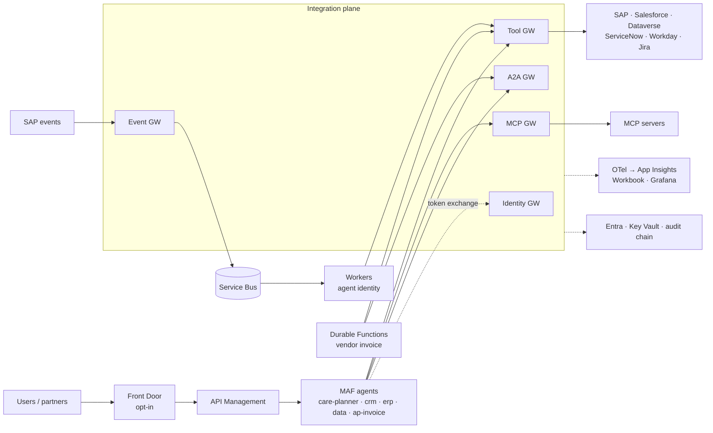
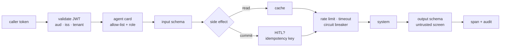

# Enterprise AI Integration Platform on Azure

[](https://github.com/jagadishmazure-jpg/Jagadish-azure-ai-integration-platform/actions/workflows/ci.yml)

## At a glance (for recruiters)

- **AI agents that work safely with core business systems:** agents read from and write to SAP, Salesforce, ServiceNow, Workday, Dynamics and Jira only through five gateways (tool, MCP, A2A, event and identity), never through direct connections.
- **Agents act with the user's own permissions:** for interactive requests, Microsoft Entra on-behalf-of (OBO) tokens mean an agent can only see and change what the signed-in user could (background workers use their own managed identity), and every action is recorded in a tamper-evident audit trail.
- **Reliable writes into systems of record:** repeated requests don't create duplicates (idempotency keys), circuit breakers stop calls to a failing system, and an HTTP 200 that hides a business error is still counted as a failure.
- **Event-driven agents and human-approved business processes:** SAP events flow through Event Grid and Service Bus to agent workers, and a Durable Functions vendor-invoice process waits for a human approval (48-hour timer) before money moves.
- **Runtime safety layer with an out-of-band watchdog:** tool code runs in a sandbox with networking off, every agent action is checked against a default-deny policy that records why it was allowed, and a separate monitor reading signed telemetry quarantines an agent within milliseconds (1-2 ms measured locally) of an injection, data leak, runaway loop or unexpected tool (9 of 9 attack scenarios contained, 0 false alarms).
- **214 automated tests** plus eval, contract and safety gates and an end-to-end demo over real HTTP run in CI.
- **Terraform + Bicep, GitHub Actions deploy:** the same infrastructure in both tools ([`infra/terraform`](infra/terraform/README.md)), and a pipeline with OIDC login (no secrets), a Bicep/Terraform choice and dev -> prod approval gates. It stays switched off until a subscription exists ([docs/deployment.md](docs/deployment.md)).

**Skills demonstrated:** Azure integration, API gateways (APIM), Microsoft Entra ID / OAuth 2.0 OBO, Event Grid, Service Bus, Durable Functions, Logic Apps, MCP, A2A, Microsoft Agent Framework, FastAPI, Bicep/azd, Terraform, GitHub Actions (OIDC), Python.

*Honesty note: it runs offline against deterministic SaaS stand-ins and has not been deployed to live Azure yet (see the note below).*

**Contents:** [What](#at-a-glance-for-recruiters) · [Why](#why-it-exists) · [Architecture](#architecture) · [Run](#run-it-about-a-minute) · [Test](#test) · [Deploy](#deploy) · [Limits](#limits) · [Docs](#documentation)

## Why it exists

**Agents that use SAP, Salesforce, ServiceNow, Workday, Dynamics and Jira without ever holding a
connection to them.**

This is the AI *integration* engineer's half of an agent platform. The agents (Microsoft Agent
Framework) are deliberately simple. The work is in the layer between them and the systems of
record: five gateways that decide **who** a call is made as, **whether** it is allowed, whether
it is **safe to repeat**, and whether the **business step actually completed**.

> Built and tested offline against sandbox stand-ins; nothing is deployed. The Azure code paths
> (MSAL, Key Vault, Service Bus, Event Grid, Durable Functions, Foundry) are written and
> type-correct but not exercised against a live tenant. See [docs/sdk-notes.md](docs/sdk-notes.md).

## What it shows

| Capability | Proof in this repo |
|---|---|
| **Tool Gateway** - per-agent-card allow-lists, read / simulate / commit classes, per-tenant rate limit, short-TTL cache, circuit breaker, JSON-schema in/out, idempotency keys, timeouts, sanitized errors, hash-chained audit | demo steps 3-6, `tests/test_28_tool_gateway.py` |
| **MCP Gateway** - catalog, discovery, governed calls to 3 MCP servers (SAP orders, ServiceNow incidents, SQL warehouse); read-only by default, HITL + idempotent writes, server output screened as untrusted | demo step 7, `tests/test_29_mcp_gateway.py` |
| **A2A Gateway + directory** - versioned agent cards (owner, SLA, input schema, eval score, side-effect class), caller allow-lists, hop cap, traceparent + tenant propagation | demo step 1, `tests/test_30_a2a_gateway.py` |
| **Event-driven agents** - canonical SAP events → Event Gateway → queues → workers with their own identity; dedupe on business key, per-class budget, dead-letter | demo step 8, `tests/test_31_events.py` |
| **BPM + agent** - Durable Functions owns the vendor-invoice money process; agents extract / classify / draft; human approval with a 48 h timer; compensation; process id → graph run ids. Logic Apps alternative included | demo step 9, `tests/test_32_bpm.py` |
| **Identity: as whom?** - OBO for interactive journeys, client credentials / managed identity for workers, hybrid; one app registration per workload; actor + subject on every record | demo steps 1-2, `tests/test_33_identity.py` |
| **SaaS connector packs** - Salesforce, ServiceNow, Workday, Dynamics/Dataverse, SAP OData, Jira: auth, canonical mapping, idempotent writes, error taxonomy, rate-limit hints, minimal fields | `tests/test_34_saas_connectors.py` |
| **Integration observability** - spans with system / operation / business_key / result_class; HTTP 200 with a business error counts as failure; completion metrics; Workbook + Grafana from one KQL file | demo step 10, `tests/test_35_observability.py` |
| **Runtime safety** - agent sandbox (subprocess, deny-by-default network, scoped files, CPU/memory/time limits, env allow-list; ACA dynamic sessions adapter), policy prover (YAML, default deny, proof per decision in the audit chain), Ed25519-signed audit chains, out-of-band monitor with kill switch enforced by every gateway; attack/benign eval gate | [`src/aiip/safety/`](src/aiip/safety), `tests/test_37_runtime_safety.py`, `tests/test_38_out_of_band_monitor.py` |
| **Reference architecture as code** - Bicep + `azd` and a Terraform twin, cost-minimized defaults, opt-in Front Door / Private Link / AKS, gated GitHub Actions deploy with OIDC and approval gates | `infra/`, [docs/deployment.md](docs/deployment.md), `tests/test_36_reference_architecture.py` |

## Architecture



Every gateway call runs the same pipeline:



More diagrams: [architecture](docs/architecture.md) · [identity](docs/identity.md) ·
[events](docs/events.md) · [BPM](docs/bpm.md).

## Run it (about a minute)

Requires Python 3.13.

```bash
python -m venv .venv && . .venv/bin/activate
pip install -e ".[dev]"
python scripts/demo.py            # starts 15 processes on 127.0.0.1:8401-8431, runs every drill
pytest -q                         # offline, ~15 s
python scripts/run_safety_evals.py  # attack/benign runtime-safety gate
```

What the demo prints (abridged, from a real run):

```text
=== 1. Interactive journey, user-scoped (OBO): planner fans out over A2A
  [ok] fan-out: ['crm', 'data', 'erp'] acting as user alice@co...
  [ok] idempotent retry of the whole journey: case 500A000002 replayed, not duplicated
=== 2. authz_deny: same question, different user (record-level ACL in the CRM)
  [ok] bob (West care rep): I can't show account ACC-1001 to you (authz_deny).
=== 3. Idempotent commit: retry with the same key, then again after a gateway restart
  [ok] retry after gateway restart (idempotency cache lost): replay_source=vendor; SAP holds 1 invoice(s) for INV-9001
=== 4. business_reject: SAP answers HTTP 200 with a BAPI error in the payload
  [ok] gateway result: HTTP 422 business_reject: Tax code V9 not defined for country US
=== 6. Circuit breaker: SAP starts failing
  [ok] HTTP 503 in 10 ms: sap circuit open; failing fast
=== 7. MCP Gateway: catalog, read-only SQL, PII refusal, injection screening, HITL writes
  [ok] ServiceNow incident with an injected instruction: 1 field(s) withheld
=== 8. Event-driven agents
  [ok] event storm (8 ShipmentLate in a burst, budget 5/min per tenant): {'parked_budget': 5, 'accepted': 3}
=== 9. BPM + agent
  [ok] carol approves with her own token at the Tool Gateway: approved
  [ok] INV-7790: nobody approves, virtual clock +49h: timed_out_compensated (parked invoice deleted)
=== 10. Integration observability
  [ok] tool-gateway identity mix: {'obo': 14, 'agent': 32}
```

`python scripts/demo.py --inproc` runs the same scenarios in one process (used by the tests).

## Test

```bash
ruff check . && ruff format --check .
pytest -q                                     # 214 offline tests, including repo hygiene
python scripts/run_eval_gate.py --no-write    # eval + contract gate
python scripts/run_safety_evals.py --no-write # attacks contained, no false quarantines
python scripts/export_contracts.py --check && python scripts/build_dashboards.py --check
cd infra/terraform && terraform init -backend=false && terraform validate && terraform test
```

CI runs all of these plus the HTTP demo and `bicep build` ([`.github/workflows/`](.github/workflows/README.md)).

## Deploy

Two paths, neither of which has been run yet: `azd up` from a laptop ([docs/deploy.md](docs/deploy.md)), or the GitHub Actions pipeline ([docs/deployment.md](docs/deployment.md)) with a Bicep or Terraform choice, OIDC login and dev -> prod approval. The pipeline stays switched off until the repository variable `DEPLOY_ENABLED` is set. Billing dimensions: [docs/cost-estimate.md](docs/cost-estimate.md).

## Repo map

| File | What it does |
|---|---|
| [`src/aiip/`](src/aiip) | The platform: `identity/`, `tools/`, `mcp/`, `mcp_servers/`, `a2a/`, `agents/`, `events/`, `bpm/`, `connectors/`, `fakesaas/`, `safety/`, `shared/` |
| [`functions/`](functions) | Azure Functions (Python v2) app hosting the Durable vendor-invoice orchestration |
| [`logicapps/`](logicapps) | The same process as a Logic Apps Standard workflow, for comparison |
| [`control-plane/`](control-plane) | Generated contracts: agent cards, tool registry, MCP catalog, app registrations |
| [`evals/`](evals) | Golden cases and scores for the eval + contract gate; runtime-safety attack/benign scenarios |
| [`observability/`](observability) | KQL source, Azure Monitor workbook, Grafana dashboard |
| [`infra/`](infra) | Bicep for `azd` (subscription scope, cost-minimized defaults) and the Terraform twin in [`infra/terraform`](infra/terraform/README.md) |
| [`scripts/`](scripts) | Demo, eval gate, safety gate, contract export, dashboard build, packaging hooks, originality check |
| [`tests/`](tests) | Offline test suite, one file per integration topic, with failure drills |
| [`docs/`](docs) | Architecture, identity, events, BPM, connectors, observability, interview guide, SDK notes, cost, deploy, best practices, ADRs |
| [`SECURITY.md`](SECURITY.md) · [`CONTRIBUTING.md`](CONTRIBUTING.md) · [`CHANGELOG.md`](CHANGELOG.md) | Vulnerability reporting, contribution rules, change history |
| [`azure.yaml`](azure.yaml) | `azd` services (one image, many commands) and hooks |
| [`Dockerfile`](Dockerfile) | Single platform image (Python 3.13 slim, non-root) |
| [`.github/workflows/`](.github/workflows) | CI (lint, tests, eval gate, safety gate, contract/dashboard drift, demo, bicep build), Terraform checks, and the gated OIDC deploy / teardown pipeline |
| [`.env.example`](.env.example) | Every setting, none of them secret |

## Industry mapping

| Industry | Where this pattern lands |
|---|---|
| Manufacturing / supply chain | late-shipment events trigger customer outreach; order simulation before any commit |
| Financial services / shared services | invoice and payment processes on BPM rails, amount-bound approvals, audit chain |
| Healthcare | OBO keeps record-level access intact; canonical mapping drops fields the agent does not need |
| Retail | order events deduplicated by business key; event budgets during promotion spikes |
| IT operations | ServiceNow incidents from events; injected text in tickets never reaches a model |

## Design choices worth asking about

* **Why five services, not a shared library?** One review surface, one breaker and rate limit per
  system, and agents that cannot bypass policy because they have nothing to bypass it with.
* **Why is HITL enforced in the Tool Gateway rather than the workflow?** So a forged or replayed
  approval event cannot move money: the approval is bound to approver, business key and amount.
* **Why two layers of idempotency?** The gateway cache handles quick retries; SAP's
  `Repeatability-Request-ID` handles retries after the gateway forgot. The demo restarts the cache
  to prove it.
* **Why park events instead of dropping them?** A storm should cost a queue, not a model budget,
  and the business event must survive.

The [interview guide](docs/interview-guide.md) maps common interview questions to code.

## Status

| | |
|---|---|
| Tests | offline pytest suite, ruff clean, eval + contract gate, runtime-safety gate, all in CI |
| Infra | `bicep build` clean with no warnings; Terraform `validate`, offline `terraform test`, tflint and checkov (CI); not deployed |
| External systems | sandbox stand-ins only ([`src/aiip/fakesaas`](src/aiip/fakesaas)) |
| Cost | [billing dimensions + official pricing links](docs/cost-estimate.md), no invented prices |

## Limits

* Nothing is deployed. The Azure code paths (MSAL, Key Vault, Service Bus, Event Grid, Durable Functions, Foundry) are written against the real SDKs but have only run offline ([docs/sdk-notes.md](docs/sdk-notes.md)).
* Every SaaS system is a sandbox stand-in; no vendor sandbox has been connected.
* The Terraform twin passes validate, offline `terraform test`, tflint and checkov, but no plan has run against a subscription. The deploy pipeline's GitHub Environments and reviewers do not exist yet.
* Eval and safety scores come from small synthetic scenario sets. The watchdog latency (1-2 ms) was measured on a laptop, not in Azure.

## Documentation

| Document | What it covers |
|---|---|
| [`docs/best-practices.md`](docs/best-practices.md) | Enterprise cloud and agentic AI practices, each marked implemented, written-not-deployed or planned, with links to the code |
| [`docs/adr/`](docs/adr/README.md) | Architecture decision records (Bicep + Terraform, offline mocks, OIDC, eval gates, gated deploy, ...) |
| [`docs/deployment.md`](docs/deployment.md) | The GitHub Actions pipeline and the one-time Azure setup it needs |
| [`docs/architecture.md`](docs/architecture.md) · [`docs/identity.md`](docs/identity.md) · [`docs/interview-guide.md`](docs/interview-guide.md) | Architecture, the identity model, interview questions mapped to code |
| [`SECURITY.md`](SECURITY.md) · [`CONTRIBUTING.md`](CONTRIBUTING.md) · [`CHANGELOG.md`](CHANGELOG.md) | How to report a vulnerability, how to contribute, what changed |

MIT licensed. Author: Jagadish Meduri.
