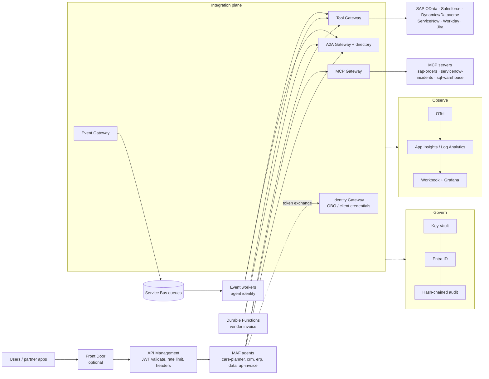
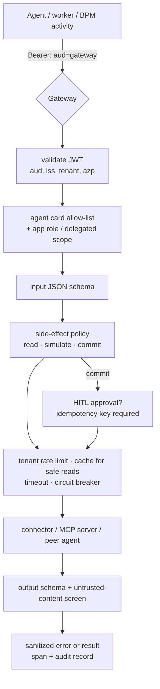

# Architecture

The platform is the layer between the agent runtime (Microsoft Agent Framework) and the systems of
record. Agents never get a connection string, a vendor token or a JDBC URL. They get **five
gateways**, each a separate FastAPI service with one job, and every one of them validates Entra
tokens with the same code (`aiip.shared.auth`), resolves vendor credentials only through Key Vault
references (`kv://…`), and emits OpenTelemetry spans with integration attributes.

## Reference topology

## The five gateways

| Gateway | Service | Owns |
|---|---|---|
| Identity | `aiip.identity.gateway` (8401) | Token exchange: OBO for user journeys, client credentials for agent-scoped work, app registration catalog, JWKS in local mode |
| Tool | `aiip.tools.gateway` (8402) | Tool registry, per-card allow-lists, side-effect classes, rate limit, short-TTL cache, circuit breaker, schema validation, idempotency, HITL approvals, audit |
| MCP | `aiip.mcp.gateway` (8403) | MCP server catalog, discovery, governed invocation, read-only default, HITL writes, untrusted output screening |
| A2A | `aiip.a2a.gateway` (8404) | Agent directory (cards with SLA, owner, eval score, versions), caller allow-lists, hop cap, traceparent/tenant propagation |
| Event | `aiip.events.gateway` (8405) | CloudEvents admission: schema, tenant, dedupe on business key, per-class budget, routing to queues, dead-letter/parked visibility |

## Why gateways instead of connections in agents

* **One review surface.** Security reviews five services instead of every agent's vendor code.
* **Blast radius.** An agent card lists exactly which tools it may call; the gateway enforces it.
  A compromised or confused agent cannot call a tool it was never granted.
* **Reuse.** `erp.get_sales_order` serves the care planner, the order-event worker and the
  invoice process. One connector pack, one set of field mappings, one breaker per system.
* **Operability.** Rate limits, caching and circuit breaking only work when all traffic to a
  system passes one place.

## Hosting

* Gateways, agents, MCP servers and workers ship as **one container image** with different
  commands, deployed to **Container Apps** (scale to zero) or, with `computeProfile=aks`, an AKS
  cluster (free tier, workload identity, KEDA).
* Workers scale on **Service Bus queue depth** through KEDA.
* The money process runs on **Durable Functions (Flex Consumption)**; a Logic Apps Standard
  definition of the same process is included for comparison (`logicapps/`).
* **APIM** is the contract for anything public or partner-facing; **Front Door** and **Private
  Link** are opt-in (`deployFrontDoor`, `privateNetworking`).

## Local mode vs Azure mode

`AIIP_MODE=local` (default) swaps three things for local stand-ins: the token issuer (an RS256
issuer inside the Identity Gateway with a JWKS endpoint), the secret store (an in-memory
`kv://` resolver) and the bus (an in-memory peek-lock queue hosted by the Event Gateway). All
business systems are sandbox stand-ins (`aiip.fakesaas`). `AIIP_MODE=azure` switches the same
code paths to MSAL, Key Vault, Service Bus / Event Grid and `FoundryChatClient`. See
[sdk-notes.md](sdk-notes.md) for what has and has not been exercised against real Azure.
