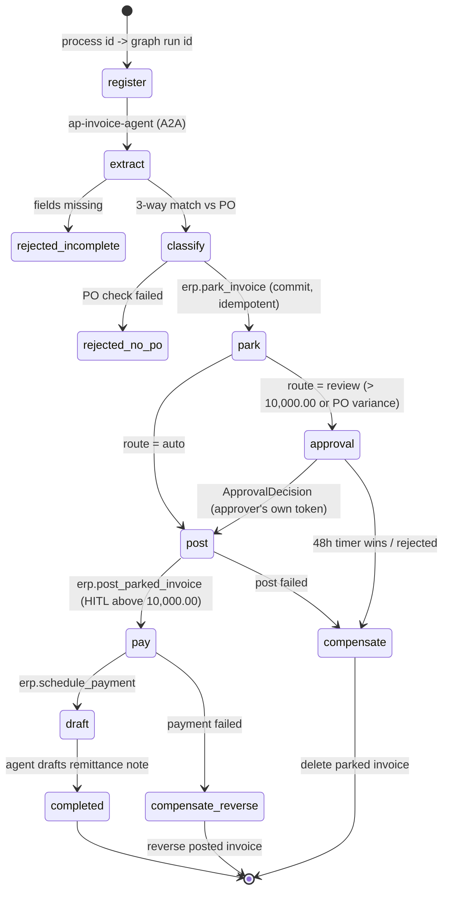

# BPM + agent: the process owns the money

A vendor invoice is a money-and-compliance process. The **Durable Functions orchestration is the
parent**: it holds state, timers, human approval and compensation. Agents are called as
**activities** for the language work (extract, classify, draft) and never post money themselves.

## How the pieces line up

| Concern | Where |
|---|---|
| Orchestrator (deterministic generator: no I/O, no clock, no random) | `src/aiip/bpm/orchestration.py` |
| Activities (all side effects, each through a gateway with the orchestrator's own identity) | `src/aiip/bpm/activities.py` |
| Azure Functions app (Python v2 model: `DFApp`, HTTP starter, approval webhook, triggers) | `functions/function_app.py` |
| Offline replay runtime with a virtual clock (tests + demo) | `src/aiip/bpm/local_runtime.py`, `src/aiip/bpm/host.py` |
| Logic Apps Standard alternative of the same process | `logicapps/vendor-invoice/workflow.json` |

## Controls

* **HITL at the gateway, not in the orchestrator.** `erp.post_parked_invoice` has
  `hitl_above = 10,000.00`. Above that the Tool Gateway answers `428 approval_required` unless the
  call carries an approval that (a) was decided by the approver the process resolved from Workday,
  (b) was decided with that user's own token, and (c) matches the business key and amount. A forged
  `ApprovalDecision` event sent straight to the orchestrator therefore cannot move money.
* **Amount binding.** The SAP stand-in rejects a post whose gross amount differs from the parked
  document (`M8/108`), so an approval for 12,000 cannot post 120,000.
* **Idempotency.** Every commit carries a key derived from process id + step, so an activity retry
  after a crash replays the vendor's answer instead of posting twice.
* **Timeout.** A durable timer races the approval event (`task_any`). If the timer wins, the
  compensation stack runs (delete parked invoice) and the outcome is `timed_out_compensated`.
* **Compensation stack.** Each successful commit pushes its undo; failures unwind in reverse.
* **Process-to-graph mapping.** `register_run` records `process_id → [graph run ids]`, exposed at
  `/v1/process-map/{process_id}`, so an auditor can go from the SAP document to the agent traces.

## Proven against the real Durable SDK

`tests/test_32_bpm.py` replays the same orchestrator generator through
`azure.durable_functions.DurableOrchestrationContext` using a hand-built history and checks the
scheduled actions, so the code is not only correct against the local stand-in runtime. Running
it on a real Functions host and Durable Task storage has **not** been done (see sdk-notes).
