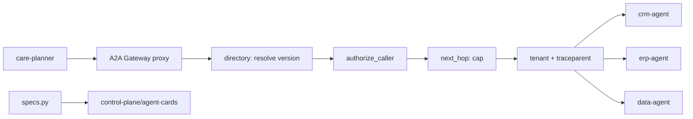

# A2A Gateway and directory (`src/aiip/a2a/`)

A governed JSON-RPC proxy for agent-to-agent calls plus a directory of versioned agent cards.

**Sections:** [1. Purpose](#1-purpose) · [2. Architecture](#2-architecture) · [3. How it works](#3-how-it-works) · [4. Key files](#4-key-files) · [5. Code excerpts](#5-code-excerpts) · [6. Configuration](#6-configuration) · [7. Commands](#7-commands) · [8. Real output](#8-real-output) · [9. Tests and eval gates](#9-tests-and-eval-gates) · [10. Guardrails](#10-guardrails) · [11. Security and governance](#11-security-and-governance) · [12. Observability](#12-observability) · [13. Failure modes](#13-failure-modes) · [14. Mapping to Azure services](#14-mapping-to-azure-services) · [15. Limitations](#15-limitations) · [16. Interview talking points](#16-interview-talking-points) · [17. Adopt this](#17-adopt-this)

## 1. Purpose

Let agents delegate to other agents (the care planner to CRM, ERP and data agents) with the same controls as API calls: versioned contracts, caller allow-lists, a hop cap, tenant and trace propagation.

## 2. Architecture



## 3. How it works

1. `specs.py` defines each agent's skills, input schemas, side-effect class, SLA, owner, allowed tools and callers.
2. `cards.py` renders A2A 1.0 agent cards with this metadata; `export_contracts.py` writes them to `control-plane/agent-cards/`.
3. `proxy` checks the audience, resolves the callee version, checks the caller allow-list and increments the hop count.
4. The callee server re-validates the bearer token per task.

## 4. Key files

| File | What it does |
|---|---|
| `src/aiip/a2a/gateway.py` | proxy and directory endpoints |
| `src/aiip/a2a/directory.py` | version resolution, allow-lists, hop cap |
| `src/aiip/a2a/specs.py` | agent contracts |
| `src/aiip/a2a/cards.py` | card rendering |
| `src/aiip/a2a/client.py` | client that always goes through the gateway |

## 5. Code excerpts

<!-- code: src/aiip/a2a/directory.py::next_hop -->
```python
def next_hop(current: str | None) -> int:
    try:
        hops = int(current or 0)
    except ValueError:
        hops = 0
    if hops + 1 > MAX_HOPS:
        raise E.GatewayError(E.AUTHZ_DENY, f"hop cap exceeded ({MAX_HOPS})")
    return hops + 1
```
<!-- /code -->

<!-- code: src/aiip/a2a/directory.py::authorize_caller -->
```python
def authorize_caller(caller: str, callee: AgentSpec) -> None:
    if caller not in callee.allowed_callers:
        raise E.GatewayError(E.AUTHZ_DENY, f"{caller} is not on {callee.id}'s caller allow-list")
```
<!-- /code -->

## 6. Configuration

`MAX_HOPS` in `directory.py`; agent versions and callers in `specs.py`; eval scores read from `evals/scores.json` (`AIIP_EVAL_SCORES`).

## 7. Commands

```bash
python scripts/export_contracts.py --check
pytest tests/test_30_a2a_gateway.py -q
```

## 8. Real output

<!-- output: python scripts/doc_demo.py demo 1 -->
```text
=== 1. Interactive journey, user-scoped (OBO): planner fans out over A2A ==
  [ok] alice (East care rep): Northwind Traders (Gold, east). SLA: Gold 4h response. Order 4500001 is in_process, requested for 2026-09-20. Delivery 80000001 is 7 day(s) late (revised 2026-09-27, carrier CARRIER-07). Region on-time rate last week: 91%. Case 500A000002 opened for the late delivery.
  [ok] fan-out: ['crm', 'data', 'erp'] acting as user alice@co..., <n> ms end to end
  [ok] idempotent retry of the whole journey: case 500A000002 replayed, not duplicated
```
<!-- /output -->

<!-- output: python scripts/export_contracts.py --check -->
```text
contracts up to date
```
<!-- /output -->

## 9. Tests and eval gates

<!-- output: python -m pytest --co -q -p no:cacheprovider tests/test_30_a2a_gateway.py | grep '::' -->
```text
tests/test_30_a2a_gateway.py::test_directory_lists_every_agent_with_its_contract
tests/test_30_a2a_gateway.py::test_each_agent_serves_a_well_known_card[crm_app-crm-agent]
tests/test_30_a2a_gateway.py::test_each_agent_serves_a_well_known_card[erp_app-erp-agent]
tests/test_30_a2a_gateway.py::test_each_agent_serves_a_well_known_card[data_app-data-agent]
tests/test_30_a2a_gateway.py::test_each_agent_serves_a_well_known_card[ap_invoice_app-ap-invoice-agent]
tests/test_30_a2a_gateway.py::test_each_agent_serves_a_well_known_card[care_planner_app-care-planner]
tests/test_30_a2a_gateway.py::test_versioning_resolves_major_and_exact_and_routes_to_v2_path
tests/test_30_a2a_gateway.py::test_v2_contract_accepts_new_shape_and_v1_rejects_it
tests/test_30_a2a_gateway.py::test_caller_allow_list_is_enforced
tests/test_30_a2a_gateway.py::test_hop_cap_stops_runaway_delegation
tests/test_30_a2a_gateway.py::test_tenant_header_must_match_token
tests/test_30_a2a_gateway.py::test_a2a_version_header_is_required
tests/test_30_a2a_gateway.py::test_traceparent_is_propagated_to_the_callee_and_audited
tests/test_30_a2a_gateway.py::test_planner_fans_out_and_every_hop_acts_as_the_user
tests/test_30_a2a_gateway.py::test_domain_agents_run_on_microsoft_agent_framework
tests/test_30_a2a_gateway.py::test_every_agent_has_owner_version_and_sla
tests/test_30_a2a_gateway.py::test_worker_can_only_reach_agents_it_holds_a_role_for
```
<!-- /output -->

## 10. Guardrails

- Callers not on the callee's list are refused.
- Hop cap prevents agent loops.
- A user token sent straight to a downstream agent is refused; the caller must be the planner.

## 11. Security and governance

- Cards carry owner, SLA and eval score and are reviewed as code.
- Tenant headers must match the token.

## 12. Observability

traceparent propagated per hop; a2a-gateway success by system in demo step 10.

## 13. Failure modes

| Failure | Result |
|---|---|
| caller not allowed | 403 `authz_deny` |
| hop cap exceeded | 403 |
| tenant mismatch | 403 |

## 14. Mapping to Azure services

| Piece | Azure service |
|---|---|
| gateway and agents | Azure Container Apps |
| identity | Entra app registrations per agent |

## 15. Limitations

- Directory is code plus generated JSON, not a managed registry.

## 16. Interview talking points

- Agent delegation needs contracts and a hop cap, just like microservices need timeouts.

## 17. Adopt this

1. Add an `AgentSpec` in `specs.py`.
2. Run `export_contracts.py` and commit the card.
3. Call it via `a2a/client.py` so the gateway is always in the path.
