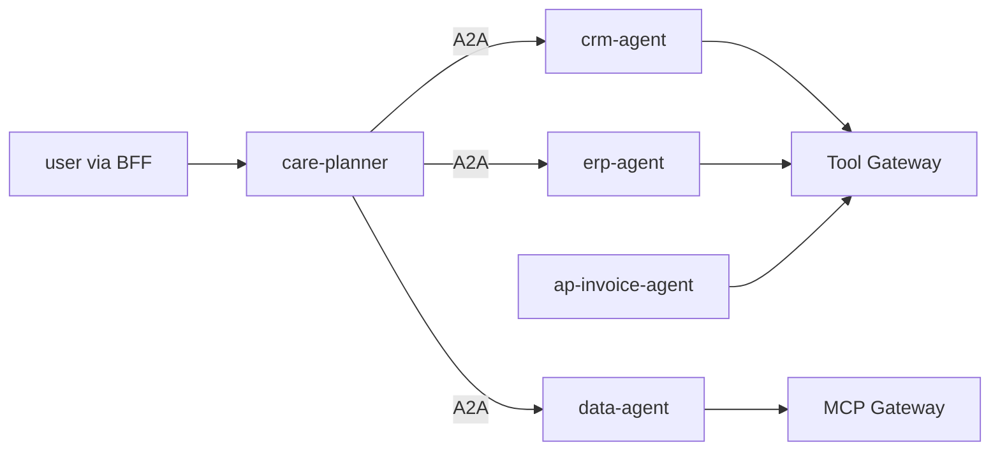

# Domain agents (`src/aiip/agents/`)

Deliberately simple Microsoft Agent Framework agents: a customer-care planner plus CRM, ERP, data and AP-invoice agents. They hold no connections.

**Sections:** [1. Purpose](#1-purpose) · [2. Architecture](#2-architecture) · [3. How it works](#3-how-it-works) · [4. Key files](#4-key-files) · [5. Code excerpts](#5-code-excerpts) · [6. Configuration](#6-configuration) · [7. Commands](#7-commands) · [8. Real output](#8-real-output) · [9. Tests and eval gates](#9-tests-and-eval-gates) · [10. Guardrails](#10-guardrails) · [11. Security and governance](#11-security-and-governance) · [12. Observability](#12-observability) · [13. Failure modes](#13-failure-modes) · [14. Mapping to Azure services](#14-mapping-to-azure-services) · [15. Limitations](#15-limitations) · [16. Interview talking points](#16-interview-talking-points) · [17. Adopt this](#17-adopt-this)

## 1. Purpose

Show agents that do useful work while every tool is a gateway call with a token from the Identity Gateway.

## 2. Architecture



## 3. How it works

1. `maf.py` provides a deterministic offline chat client (a real `BaseChatClient` with function invocation) and `FoundryChatClient` in Azure mode.
2. `gateways.call_tool` and `call_mcp` are the only way agents reach systems.
3. The planner fans out over A2A with the user's token, adds a KPI lookup and opens a case idempotently.

## 4. Key files

| File | What it does |
|---|---|
| `src/aiip/agents/maf.py` | chat clients |
| `src/aiip/agents/gateways.py` | gateway calls |
| `src/aiip/agents/planner.py` | planner |
| `src/aiip/agents/domain.py` | domain agents |
| `src/aiip/agents/apps.py` | ASGI apps |

## 5. Code excerpts

<!-- code: src/aiip/agents/gateways.py::call_tool -->
```python
async def call_tool(
    name: str,
    args: dict[str, Any],
    *,
    token: str,
    traceparent: str | None = None,
    idempotency_key: str | None = None,
    approval_id: str | None = None,
) -> dict[str, Any]:
    headers = {"authorization": f"Bearer {token}"}
    if traceparent:
        headers["traceparent"] = traceparent
    if idempotency_key:
        headers["idempotency-key"] = idempotency_key
    if approval_id:
        headers["x-approval-id"] = approval_id
    async with http.client("tool-gateway", timeout=15) as c:
        r = await c.post(f"/v1/tools/{name}/invoke", json={"args": args}, headers=headers)
    if r.status_code != 200:
        _raise(r)
    return r.json()
```
<!-- /code -->

## 6. Configuration

`AIIP_MODE` selects the offline client or Foundry.

## 7. Commands

```bash
python -m aiip.agents crm-agent
python scripts/run_eval_gate.py --no-write
```

## 8. Real output

<!-- output: python scripts/doc_demo.py evals -->
```text
  PASS ap-invoice-agent   ap-01      invoice.amount='12000.00'
  PASS ap-invoice-agent   ap-02      missing=['po_id', 'supplier_id', 'tax_code']
  PASS ap-invoice-agent   ap-03      route='auto'
  PASS ap-invoice-agent   ap-04      route='review'
  PASS ap-invoice-agent   ap-05      route='reject'
  PASS ap-invoice-agent   ap-06      text='Invoice INV-1 was posted as 5105600009; payment is scheduled.'
  PASS care-planner       care-01    answer='Northwind Traders (Gold, east). SLA: Gold 4h response. Order 4500001 is in_process, requested for 2026-09-20. Delivery 80000001 is 7 day(s) late (revised 2026-09-27, carrier CARRIER-07). Region on-time rate last week: 91%.'
  PASS care-planner       care-02    fan_out=['crm', 'data', 'erp']
  PASS care-planner       care-03    result_class='authz_deny'
  PASS care-planner       care-04    case.case.case_id='500A000002'
  PASS care-planner       care-05    acting_as='bob@contoso.example'
  PASS crm-agent          crm-01     account.name='Northwind Traders'
  PASS crm-agent          crm-02     account.credit_hold=True
  PASS crm-agent          crm-03     expected error authz_deny, got authz_deny
  PASS crm-agent          crm-04     account.region='west'
  PASS crm-agent          crm-05     account.tier='Gold'
  PASS crm-agent          crm-06     expected error validation_error, got validation_error
  PASS data-agent         data-01    region='east'
  PASS data-agent         data-02    len(weeks)=2
  PASS data-agent         data-03    expected error validation_error, got validation_error
  PASS erp-agent          erp-01     delivery.days_late=7.0
  PASS erp-agent          erp-02     order.status='open'
  PASS erp-agent          erp-03     expected error not_found, got not_found
  PASS erp-agent          erp-04     simulation.net_amount='24.00'

contract checks: 28/28
ap-invoice-agent   6/6  score=1.0
care-planner       5/5  score=1.0
crm-agent          6/6  score=1.0
data-agent         3/3  score=1.0
erp-agent          4/4  score=1.0
GATE PASSED
```
<!-- /output -->

## 9. Tests and eval gates

Golden cases per agent in `evals/golden/` run through the eval and contract gate shown above; CI fails if any agent's score drops.

## 10. Guardrails

- No connection strings in agents.
- Idempotent case creation.

## 11. Security and governance

- Interactive agents act as the user via OBO.

## 12. Observability

Agent calls appear inside gateway traces via traceparent.

## 13. Failure modes

Gateway errors are returned as sanitized codes and the agent explains them (for example `authz_deny` in demo step 2).

## 14. Mapping to Azure services

| Piece | Azure service |
|---|---|
| models | Microsoft Foundry |
| hosting | Container Apps |

## 15. Limitations

- Offline client follows a plan; real model behaviour not evaluated here.

## 16. Interview talking points

- The integration layer is where the work is; agents stay thin.

## 17. Adopt this

1. Write a handler in `domain.py` calling `call_tool`.
2. Add a spec and golden cases.
