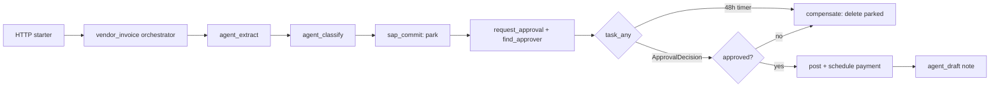

# BPM vendor-invoice process (`src/aiip/bpm/`, `functions/`, `logicapps/`)

A Durable Functions orchestration owns the money process; agents only extract, classify and draft. A Logic Apps Standard workflow shows the same process for comparison.

**Sections:** [1. Purpose](#1-purpose) · [2. Architecture](#2-architecture) · [3. How it works](#3-how-it-works) · [4. Key files](#4-key-files) · [5. Code excerpts](#5-code-excerpts) · [6. Configuration](#6-configuration) · [7. Commands](#7-commands) · [8. Real output](#8-real-output) · [9. Tests and eval gates](#9-tests-and-eval-gates) · [10. Guardrails](#10-guardrails) · [11. Security and governance](#11-security-and-governance) · [12. Observability](#12-observability) · [13. Failure modes](#13-failure-modes) · [14. Mapping to Azure services](#14-mapping-to-azure-services) · [15. Limitations](#15-limitations) · [16. Interview talking points](#16-interview-talking-points) · [17. Adopt this](#17-adopt-this)

## 1. Purpose

Money and compliance belong to a deterministic process engine with timers and compensation. Agents are activities inside it, so the process can wait 48 hours for a named approver and undo its side effects if nobody approves.

## 2. Architecture



## 3. How it works

1. The orchestrator calls activities; each side effect goes through the Tool Gateway as the orchestrator's own identity.
2. After parking the invoice it requests an approval and races `wait_for_external_event("ApprovalDecision")` against a 48-hour timer.
3. The approver approves with their own token at the Tool Gateway, so the approval is bound to their identity.
4. Timeout or rejection runs `_compensate`, deleting the parked invoice.
5. `register_run` maps the process id to graph run ids for tracing.

## 4. Key files

| File | What it does |
|---|---|
| `src/aiip/bpm/orchestration.py` | the orchestrator |
| `src/aiip/bpm/activities.py` | activities |
| `src/aiip/bpm/local_runtime.py` | replay-based local runtime with a virtual clock |
| `functions/function_app.py` | Durable Functions app (Python v2) |
| `logicapps/vendor-invoice/workflow.json` | Logic Apps alternative |
| `docs/bpm.md` | design |

## 5. Code excerpts

Approval race and compensation:

<!-- code: src/aiip/bpm/orchestration.py:102-121 -->
```python
        timer = context.create_timer(context.current_utc_datetime + APPROVAL_TIMEOUT)
        decision_task = context.wait_for_external_event("ApprovalDecision")
        winner = yield context.task_any([decision_task, timer])
        if winner == decision_task:
            timer.cancel()
            decision = decision_task.result or {}
        else:
            yield from _compensate(context, base, compensation)
            return (yield from _finish(context, base, "timed_out_compensated", {"invoice_document": doc}))
        if not decision.get("approved"):
            yield from _compensate(context, base, compensation)
            return (
                yield from _finish(
                    context,
                    base,
                    "rejected_by_approver",
                    {"invoice_document": doc, "approver": decision.get("approver")},
                )
            )
        approval_id = decision.get("approval_id", approval_id)
```
<!-- /code -->

<!-- code: src/aiip/bpm/orchestration.py::_compensate -->
```python
def _compensate(context, base: dict, stack: list[tuple[str, str]]):
    for tool, doc in reversed(stack):
        context.set_custom_status({"stage": "compensating", "tool": tool, "invoice_document": doc})
        yield context.call_activity(
            "sap_commit", {**base, "tool": tool, "args": {"invoice_document": doc}, "step": "compensate"}
        )
```
<!-- /code -->

## 6. Configuration

`APPROVAL_TIMEOUT` (48 h) in `orchestration.py`; `functions/host.json` holds the task hub settings.

## 7. Commands

```bash
pytest tests/test_32_bpm.py -q
cd functions && python -c "import function_app as f; print([x.get_function_name() for x in f.app.get_functions()])"
```

## 8. Real output

<!-- output: python scripts/doc_demo.py demo 9 -->
```text
=== 9. BPM + agent: Durable orchestration owns the money; agent does extract/classify/draft
  [ok] INV-7781 started: instance <id>..., stage=awaiting_approval, parked 5105600002, approver=carol@contoso.example
  [ok] carol approves with her own token at the Tool Gateway: approved
  [ok] process completed: completed; 10 activity executions, 2 replays; note: Invoice INV-7781 was posted as 5105600002; payment is scheduled.
  [ok] process id -> graph run ids: {'process_id': '<id>', 'process': 'vendor-invoice', 'runs': ['graph-run-<id>'], 'outcome': 'completed'}
  [ok] INV-7790: nobody approves, virtual clock +49h: timed_out_compensated (parked invoice deleted)
  [ok] audit: who did what to invoice 5105600002 (hash chain ok=True)
         <timestamp>  actor=bpm-invoice-orchestrator  subject=bpm-invoice-orchestrator  approval.request  -> ok
         <timestamp>  actor=experience-bff  subject=carol@contoso.example  approval.decision  -> ok
         <timestamp>  actor=bpm-invoice-orchestrator  subject=bpm-invoice-orchestrator  erp.post_parked_invoice  -> ok
         <timestamp>  actor=bpm-invoice-orchestrator  subject=bpm-invoice-orchestrator  erp.schedule_payment  -> ok
```
<!-- /output -->

## 9. Tests and eval gates

<!-- output: python -m pytest --co -q -p no:cacheprovider tests/test_32_bpm.py | grep '::' -->
```text
tests/test_32_bpm.py::test_auto_route_completes_without_a_human
tests/test_32_bpm.py::test_review_route_waits_then_completes_after_real_approval
tests/test_32_bpm.py::test_approver_rejection_compensates
tests/test_32_bpm.py::test_timer_timeout_compensates
tests/test_32_bpm.py::test_forged_approval_event_cannot_post_money
tests/test_32_bpm.py::test_business_reject_from_sap_ends_the_process_cleanly
tests/test_32_bpm.py::test_incomplete_invoice_is_rejected_before_any_commit
tests/test_32_bpm.py::test_process_id_maps_to_graph_run_ids
tests/test_32_bpm.py::test_activity_retry_does_not_double_post
tests/test_32_bpm.py::test_orchestrator_runs_on_the_real_durable_sdk_replay_engine
tests/test_32_bpm.py::test_review_path_schedules_timer_and_external_event_on_real_sdk
tests/test_32_bpm.py::test_function_app_registers_orchestrator_activities_and_http_routes
tests/test_32_bpm.py::test_logic_apps_alternative_has_timeout_and_compensation
```
<!-- /output -->

## 10. Guardrails

- Agents never post or pay; activities do, through the gateway.
- Approval bound to approver, business key and amount.
- Timeout compensates.

## 11. Security and governance

- Audit trail per invoice with actor and subject, hash chain verified in the demo.

## 12. Observability

Process completions recorded by outcome; process id linked to graph run ids.

## 13. Failure modes

| Failure | Result |
|---|---|
| no approval in 48 h | `timed_out_compensated` |
| approver rejects | `rejected_by_approver`, compensated |
| SAP rejects post | business_reject, process fails visibly |

## 14. Mapping to Azure services

| Piece | Azure service |
|---|---|
| orchestration | Azure Durable Functions |
| alternative | Logic Apps Standard |
| trigger | Service Bus |

## 15. Limitations

- Local runtime is a stand-in for the Durable Task framework.
- Function app not deployed.

## 16. Interview talking points

- Let the process engine own money; let agents do the language work.

## 17. Adopt this

1. Copy `orchestration.py` as a template; keep side effects in activities via the gateway.
2. Choose Durable Functions or Logic Apps by team skill; both are included.
