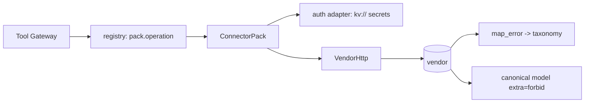

# SaaS connector packs (`src/aiip/connectors/`)

One pack per system: auth dialect, canonical mapping, idempotent writes, error taxonomy and rate-limit hints for Salesforce, ServiceNow, Workday, Dataverse, SAP OData and Jira.

**Sections:** [1. Purpose](#1-purpose) · [2. Architecture](#2-architecture) · [3. How it works](#3-how-it-works) · [4. Key files](#4-key-files) · [5. Code excerpts](#5-code-excerpts) · [6. Configuration](#6-configuration) · [7. Commands](#7-commands) · [8. Real output](#8-real-output) · [9. Tests and eval gates](#9-tests-and-eval-gates) · [10. Guardrails](#10-guardrails) · [11. Security and governance](#11-security-and-governance) · [12. Observability](#12-observability) · [13. Failure modes](#13-failure-modes) · [14. Mapping to Azure services](#14-mapping-to-azure-services) · [15. Limitations](#15-limitations) · [16. Interview talking points](#16-interview-talking-points) · [17. Adopt this](#17-adopt-this)

## 1. Purpose

Each vendor fails differently. Packs translate their wire formats and errors into one taxonomy and one set of canonical models, so the gateway's policy is vendor-neutral and agents receive only the fields they need.

## 2. Architecture



## 3. How it works

1. `registry.resolve` maps `<pack>.<operation>` to a pack instance.
2. The pack's auth adapter fetches credentials from `kv://` references (Key Vault in Azure).
3. Writes use the vendor's idempotency mechanism: SAP `Repeatability-Request-ID`, Salesforce external-id upsert, ServiceNow correlation id, Jira labels.
4. `status_class` and each pack's `map_error` classify failures; SAP BAPI RETURN messages in a 200 become `business_reject`.
5. Canonical Pydantic models with `extra=forbid` are the data-minimization boundary.

## 4. Key files

| File | What it does |
|---|---|
| `src/aiip/connectors/base.py` | contract, taxonomy, HTTP client |
| `src/aiip/connectors/canonical.py` | canonical models |
| `src/aiip/connectors/sap_odata.py` | SAP S/4HANA OData |
| `src/aiip/connectors/salesforce.py` | Salesforce |
| `src/aiip/connectors/dataverse.py` | Dataverse |
| `docs/connectors.md` | per-vendor notes |

## 5. Code excerpts

<!-- code: src/aiip/connectors/base.py::status_class -->
```python
def status_class(status: int) -> str | None:
    if status < 400:
        return None
    return {
        401: AUTH_EXPIRED,
        403: AUTHZ,
        404: NOT_FOUND,
        409: CONFLICT,
        412: CONFLICT,
        429: RATE_LIMITED,
    }.get(status, VALIDATION if status < 500 else TRANSIENT)
```
<!-- /code -->

## 6. Configuration

Vendor base URLs and `kv://` secret references per pack; `AIIP_KEYVAULT_NAME` selects the vault in Azure.

## 7. Commands

```bash
pytest tests/test_34_saas_connectors.py -q
```

## 8. Real output

<!-- output: python -m pytest --co -q -p no:cacheprovider tests/test_34_saas_connectors.py | grep '::' -->
```text
tests/test_34_saas_connectors.py::test_one_pack_per_saas_and_each_declares_its_contract
tests/test_34_saas_connectors.py::test_every_sandbox_response_is_labeled_as_a_stand_in
tests/test_34_saas_connectors.py::test_salesforce_maps_to_canonical_customer_and_drops_sensitive_fields
tests/test_34_saas_connectors.py::test_workday_never_maps_sensitive_hr_fields
tests/test_34_saas_connectors.py::test_canonical_models_forbid_unmapped_fields
tests/test_34_saas_connectors.py::test_writes_are_idempotent_at_the_vendor[salesforce.upsert_case-args0-case_id]
tests/test_34_saas_connectors.py::test_writes_are_idempotent_at_the_vendor[servicenow.create_incident-args1-number]
tests/test_34_saas_connectors.py::test_writes_are_idempotent_at_the_vendor[jira.create_issue-args2-issue_key]
tests/test_34_saas_connectors.py::test_writes_are_idempotent_at_the_vendor[sap_odata.park_invoice-args3-invoice_document]
tests/test_34_saas_connectors.py::test_dataverse_upsert_uses_alternate_key
tests/test_34_saas_connectors.py::test_error_taxonomy[salesforce-resp0-validation]
tests/test_34_saas_connectors.py::test_error_taxonomy[salesforce-resp1-authz_deny]
tests/test_34_saas_connectors.py::test_error_taxonomy[salesforce-resp2-rate_limited]
tests/test_34_saas_connectors.py::test_error_taxonomy[sap_odata-resp3-not_found]
tests/test_34_saas_connectors.py::test_error_taxonomy[sap_odata-resp4-transient]
tests/test_34_saas_connectors.py::test_error_taxonomy[servicenow-resp5-auth_expired]
tests/test_34_saas_connectors.py::test_error_taxonomy[jira-resp6-validation]
tests/test_34_saas_connectors.py::test_error_taxonomy[dataverse-resp7-conflict]
tests/test_34_saas_connectors.py::test_error_taxonomy[workday-resp8-transient]
tests/test_34_saas_connectors.py::test_rate_limit_hints_are_parsed
tests/test_34_saas_connectors.py::test_auth_adapter_refreshes_once_on_401[sap_odata-get_purchase_order-args0]
tests/test_34_saas_connectors.py::test_auth_adapter_refreshes_once_on_401[servicenow-list_incidents-args1]
tests/test_34_saas_connectors.py::test_auth_adapter_refreshes_once_on_401[workday-get_worker-args2]
tests/test_34_saas_connectors.py::test_sap_writes_fetch_a_csrf_token_and_send_repeatability_id
tests/test_34_saas_connectors.py::test_business_error_inside_http_200_is_a_business_reject
tests/test_34_saas_connectors.py::test_sandbox_state_admin_is_read_only_view
```
<!-- /output -->

## 9. Tests and eval gates

26 connector contract tests run against the stand-ins, including error-taxonomy and idempotency cases.

## 10. Guardrails

- Only canonical fields cross the boundary; sensitive HR fields are never mapped.
- Raw secrets in config are rejected (`shared/secrets.py`).

## 11. Security and governance

- Dataverse uses OBO so user security roles apply.
- Secrets live in Key Vault, referenced not copied.

## 12. Observability

Rate-limit hints (`Sforce-Limit-Info`, ServiceNow headers) are recorded on spans.

## 13. Failure modes

| Class | Typical cause |
|---|---|
| `auth_expired` | 401 |
| `validation` | other 4xx |
| `authz_deny` | 403 |
| `not_found` | 404 |
| `conflict` | 409/412 |
| `rate_limited` | 429 |
| `business_reject` | 200 with a business error |
| `transient` | 5xx |

## 14. Mapping to Azure services

| Piece | Azure service |
|---|---|
| secrets | Key Vault |
| egress | Container Apps with NAT or Private Link |

## 15. Limitations

- All packs tested against stand-ins only; no vendor sandbox connected.

## 16. Interview talking points

- An HTTP 200 is not success until the business step completed.

## 17. Adopt this

1. Subclass the pack contract in `base.py`.
2. Map errors to the taxonomy and data to a canonical model.
3. Register in `registry.py` and add a stand-in plus contract tests.
