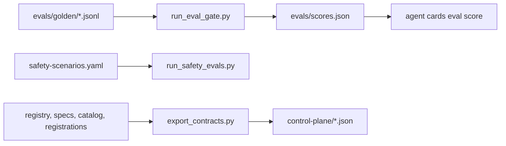

# Evals and control-plane contracts (`evals/`, `control-plane/`)

Golden cases per agent, the eval and contract gate, the runtime-safety gate, and generated contracts that CI keeps in sync with the code.

**Sections:** [1. Purpose](#1-purpose) · [2. Architecture](#2-architecture) · [3. How it works](#3-how-it-works) · [4. Key files](#4-key-files) · [5. Code excerpts](#5-code-excerpts) · [6. Configuration](#6-configuration) · [7. Commands](#7-commands) · [8. Real output](#8-real-output) · [9. Tests and eval gates](#9-tests-and-eval-gates) · [10. Guardrails](#10-guardrails) · [11. Security and governance](#11-security-and-governance) · [12. Observability](#12-observability) · [13. Failure modes](#13-failure-modes) · [14. Mapping to Azure services](#14-mapping-to-azure-services) · [15. Limitations](#15-limitations) · [16. Interview talking points](#16-interview-talking-points) · [17. Adopt this](#17-adopt-this)

## 1. Purpose

Make quality and contracts release gates: an agent whose score drops, or a registry that drifts from code, fails CI.

## 2. Architecture



## 3. How it works

1. `run_eval_gate.py` runs each agent's golden cases plus 28 contract checks and fails below threshold.
2. Scores feed the agent cards' eval score.
3. `run_safety_evals.py` runs attack and benign scenarios.
4. `export_contracts.py --check` compares generated contracts with the checked-in files.

## 4. Key files

| File | What it does |
|---|---|
| `evals/golden/` | golden cases (no README: globbed) |
| `evals/scores.json` | scores |
| `evals/safety-scenarios.yaml` | safety suite |
| `control-plane/` | generated contracts |
| `scripts/run_eval_gate.py` | gate |

## 5. Code excerpts

<!-- code: scripts/export_contracts.py::build -->
```python
def build() -> dict[Path, dict]:
    from aiip.a2a.cards import card_json
    from aiip.a2a.specs import AGENTS
    from aiip.identity.registrations import public_view
    from aiip.mcp.catalog import SERVERS
    from aiip.tools.registry import TOOLS

    files: dict[Path, dict] = {}
    for a in AGENTS:
        if a.kind == "a2a-agent":
            files[OUT / "agent-cards" / f"{a.id}@{a.version}.json"] = card_json(a)
    files[OUT / "tool-registry.json"] = {"tools": [t.public() for t in TOOLS.values()]}
    files[OUT / "mcp-catalog.json"] = {"servers": [s.public() for s in SERVERS.values()]}
    files[OUT / "app-registrations.json"] = {
        "note": "Plan for one Entra app registration per workload. client_id values are local placeholders; the real ones come from `az ad app create` (docs/identity.md).",
        "registrations": public_view(),
    }
    return files
```
<!-- /code -->

## 6. Configuration

`--no-write` runs the gates without updating score files (CI mode).

## 7. Commands

```bash
python scripts/run_eval_gate.py --no-write
python scripts/run_safety_evals.py --no-write
python scripts/export_contracts.py --check
```

## 8. Real output

<!-- output: python scripts/doc_demo.py evals -->
```text
  PASS ap-invoice-agent   ap-01      invoice.amount='12000.00'
  PASS ap-invoice-agent   ap-02      missing=['po_id', 'supplier_id', 'tax_code']
  PASS ap-invoice-agent   ap-03      route='auto'
  PASS ap-invoice-agent   ap-04      route='review'
  PASS ap-invoice-agent   ap-05      route='reject'
  PASS ap-invoice-agent   ap-06      text='Invoice INV-1 was posted as 5105600009; payment is scheduled.'
  PASS care-planner       care-01    answer='Northwind Traders (Gold, east). SLA: Gold 4h response. Order 4500001 is in_process, requested for 2026-09-20. Delivery 80000001 is 7 day(s) late (revised 2026-09-27, carrier CARRIER-07). Region on-time rate last week: 91%.'
  PASS care-planner       care-02    fan_out=['crm', 'data', 'erp']
  PASS care-planner       care-03    result_class='authz_deny'
  PASS care-planner       care-04    case.case.case_id='500A000002'
  PASS care-planner       care-05    acting_as='bob@contoso.example'
  PASS crm-agent          crm-01     account.name='Northwind Traders'
  PASS crm-agent          crm-02     account.credit_hold=True
  PASS crm-agent          crm-03     expected error authz_deny, got authz_deny
  PASS crm-agent          crm-04     account.region='west'
  PASS crm-agent          crm-05     account.tier='Gold'
  PASS crm-agent          crm-06     expected error validation_error, got validation_error
  PASS data-agent         data-01    region='east'
  PASS data-agent         data-02    len(weeks)=2
  PASS data-agent         data-03    expected error validation_error, got validation_error
  PASS erp-agent          erp-01     delivery.days_late=7.0
  PASS erp-agent          erp-02     order.status='open'
  PASS erp-agent          erp-03     expected error not_found, got not_found
  PASS erp-agent          erp-04     simulation.net_amount='24.00'

contract checks: 28/28
ap-invoice-agent   6/6  score=1.0
care-planner       5/5  score=1.0
crm-agent          6/6  score=1.0
data-agent         3/3  score=1.0
erp-agent          4/4  score=1.0
GATE PASSED
```
<!-- /output -->

## 9. Tests and eval gates

All three commands run in CI after pytest.

## 10. Guardrails

- Gates block merges, not just report.

## 11. Security and governance

- Contracts are reviewed artefacts with owners.

## 12. Observability

Score files are versioned in git.

## 13. Failure modes

| Failure | Result |
|---|---|
| score below threshold | CI fails |
| contract drift | CI fails |

## 14. Mapping to Azure services

| Piece | Azure service |
|---|---|
| evaluations | Microsoft Foundry evaluations (not wired) |
| agent catalogue | API Center or Foundry catalogue (option) |

## 15. Limitations

- Small synthetic golden sets.

## 16. Interview talking points

- Contract drift is a CI failure, not a review comment.

## 17. Adopt this

1. Add JSONL cases for a new agent.
2. Run `export_contracts.py` after changing specs and commit.
