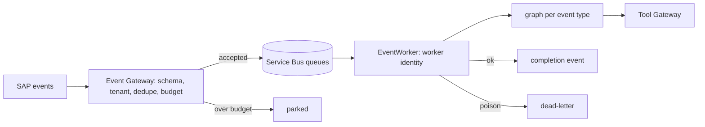

# Event Gateway and workers (`src/aiip/events/`)

SAP business events admitted as CloudEvents, deduplicated, budgeted and routed to queues, then handled by workers that run under their own identity.

**Sections:** [1. Purpose](#1-purpose) · [2. Architecture](#2-architecture) · [3. How it works](#3-how-it-works) · [4. Key files](#4-key-files) · [5. Code excerpts](#5-code-excerpts) · [6. Configuration](#6-configuration) · [7. Commands](#7-commands) · [8. Real output](#8-real-output) · [9. Tests and eval gates](#9-tests-and-eval-gates) · [10. Guardrails](#10-guardrails) · [11. Security and governance](#11-security-and-governance) · [12. Observability](#12-observability) · [13. Failure modes](#13-failure-modes) · [14. Mapping to Azure services](#14-mapping-to-azure-services) · [15. Limitations](#15-limitations) · [16. Interview talking points](#16-interview-talking-points) · [17. Adopt this](#17-adopt-this)

## 1. Purpose

Event-driven agents need protection from storms and duplicates. The gateway admits each event once per business key, enforces a per-class budget so a burst costs a queue rather than a model budget, and parks what it cannot process now.

## 2. Architecture



## 3. How it works

1. `canonical.py` defines event classes with business key, queue and budget per minute.
2. `admit` validates the CloudEvent schema and tenant, drops duplicates inside the dedupe window and takes a token from the class budget (`_budget`).
3. Accepted events are published to the queue; over-budget events are parked, not dropped.
4. `EventWorker` peek-locks a message, runs the graph for the type as the worker identity, emits a completion event and completes, abandons or dead-letters.

## 4. Key files

| File | What it does |
|---|---|
| `src/aiip/events/gateway.py` | admission and local bus endpoints |
| `src/aiip/events/canonical.py` | event classes |
| `src/aiip/events/bus.py` | in-memory bus and Service Bus / Event Grid paths |
| `src/aiip/events/worker.py` | worker loop |
| `src/aiip/events/graphs.py` | graphs per event type |
| `docs/events.md` | event design |

## 5. Code excerpts

<!-- code: src/aiip/events/gateway.py::_budget -->
```python
def _budget(ec) -> TokenBucket:
    if ec.type not in _budgets:
        _budgets[ec.type] = TokenBucket(
            capacity=ec.budget_per_minute, refill_per_s=ec.budget_per_minute / 60.0
        )
    return _budgets[ec.type]
```
<!-- /code -->

## 6. Configuration

| Variable | Effect |
|---|---|
| `AIIP_SERVICEBUS_NAMESPACE` | Service Bus namespace |
| `AIIP_EVENTGRID_TOPIC_ENDPOINT` | Event Grid topic |
| `DEDUP_WINDOW_S` | dedupe window |
| `budget_per_minute` | per event class |

## 7. Commands

```bash
pytest tests/test_31_events.py -q
```

## 8. Real output

<!-- output: python scripts/doc_demo.py demo 8 -->
```text
=== 8. Event-driven agents: SAP events -> Event Gateway -> queue -> worker (agent identity)
  [ok] admission: ['OrderCreated 4500003: accepted', 'OrderCreated 4500003: duplicate', 'ShipmentLate 80000001: accepted', 'ShipmentLate 89999999: accepted']
  [ok] event storm (8 ShipmentLate in a burst, budget 5/min per tenant): {'accepted': 3, 'parked_budget': 5}
  [ok] worker order-events: {'status': 'completed', 'outcome': 'blocked_credit_hold'}
  [ok] worker shipment-events: {'status': 'completed', 'outcome': 'customer_notified'}
  [ok] worker shipment-events: {'status': 'dead_lettered', 'result_class': 'not_found'}
  [ok] worker shipment-events: {'status': 'dead_lettered', 'result_class': 'not_found'}
  [ok] worker shipment-events: {'status': 'dead_lettered', 'result_class': 'not_found'}
  [ok] worker shipment-events: {'status': 'dead_lettered', 'result_class': 'not_found'}
  [ok] completion events emitted: ['order 4500003', 'late 80000001']
  [ok] queue depths: {'completions': {'active': 2, 'locked': 0, 'dead_letter': 0, 'parked': 0}, 'order-events': {'active': 0, 'locked': 0, 'dead_letter': 0, 'parked': 0}, 'shipment-events': {'active': 0, 'locked': 0, 'dead_letter': 4, 'parked': 5}}
```
<!-- /output -->

## 9. Tests and eval gates

<!-- output: python -m pytest --co -q -p no:cacheprovider tests/test_31_events.py | grep '::' -->
```text
tests/test_31_events.py::test_canonical_event_catalog
tests/test_31_events.py::test_admission_validates_schema_and_tenant
tests/test_31_events.py::test_publish_requires_events_publish_role
tests/test_31_events.py::test_dedup_on_business_key
tests/test_31_events.py::test_event_class_budget_parks_a_storm
tests/test_31_events.py::test_worker_runs_graph_with_agent_identity_and_emits_completion
tests/test_31_events.py::test_redelivered_message_is_not_processed_twice
tests/test_31_events.py::test_transient_failures_are_retried_then_dead_lettered
tests/test_31_events.py::test_poison_message_is_dead_lettered_immediately_with_reason
tests/test_31_events.py::test_unknown_event_type_goes_to_dead_letter
tests/test_31_events.py::test_graph_step_budget
tests/test_31_events.py::test_event_grid_webhook_validation_handshake
tests/test_31_events.py::test_in_memory_bus_lock_and_delivery_semantics
tests/test_31_events.py::test_service_bus_adapter_uses_peek_lock_settlement
tests/test_31_events.py::test_event_grid_adapter_publishes_cloudevents_with_extensions
```
<!-- /output -->

## 10. Guardrails

- Duplicates by business key are skipped.
- Budgets cap model spend during storms.
- Retryable failures are abandoned for retry; others dead-letter with a result class.

## 11. Security and governance

- Workers use their own managed identity, not a user's.
- Tenant on the event must match the publisher.

## 12. Observability

Queue depth gauges and completion metrics (`record_process`); `poison queue` KQL query.

## 13. Failure modes

| Failure | Result |
|---|---|
| duplicate | `duplicate` |
| over budget | `parked_budget` |
| record not found | dead-letter `not_found` |

## 14. Mapping to Azure services

| Piece | Azure service |
|---|---|
| ingress | Azure Event Grid |
| queues | Azure Service Bus |
| workers | Azure Container Apps with KEDA scaling on queue length |

## 15. Limitations

- Local bus is in memory; Service Bus path not exercised live.

## 16. Interview talking points

- Park, don't drop: the business event must survive a storm.

## 17. Adopt this

1. Add an event class to `canonical.py` with key, queue and budget.
2. Add a graph to `graphs.py`.
3. Run a worker for the queue.
