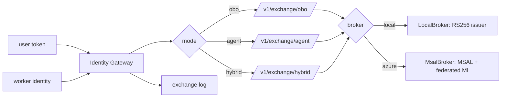

# Identity Gateway (`src/aiip/identity/`)

The only place tokens are exchanged: on-behalf-of for interactive journeys, client credentials or managed identity for workers, and a hybrid mode.

**Sections:** [1. Purpose](#1-purpose) · [2. Architecture](#2-architecture) · [3. How it works](#3-how-it-works) · [4. Key files](#4-key-files) · [5. Code excerpts](#5-code-excerpts) · [6. Configuration](#6-configuration) · [7. Commands](#7-commands) · [8. Real output](#8-real-output) · [9. Tests and eval gates](#9-tests-and-eval-gates) · [10. Guardrails](#10-guardrails) · [11. Security and governance](#11-security-and-governance) · [12. Observability](#12-observability) · [13. Failure modes](#13-failure-modes) · [14. Mapping to Azure services](#14-mapping-to-azure-services) · [15. Limitations](#15-limitations) · [16. Interview talking points](#16-interview-talking-points) · [17. Adopt this](#17-adopt-this)

## 1. Purpose

Answer "as whom?" for every call. Interactive requests run with the user's permissions (OBO), background workers with their own workload identity, and every record names both actor and subject.

## 2. Architecture



## 3. How it works

1. `registrations.py` declares one app registration per workload with exposed roles, granted roles and allowed OBO targets.
2. `exchange_obo` authenticates the calling workload, checks the target is an allowed OBO target and asks the broker for a delegated token.
3. `exchange_agent` issues a workload token with only the granted roles.
4. `LocalBroker` applies the same rules as Entra offline; `MsalBroker` uses MSAL with a federated managed-identity assertion in Azure.
5. Each exchange is logged with actor, subject, target and result.

## 4. Key files

| File | What it does |
|---|---|
| `src/aiip/identity/gateway.py` | exchange endpoints |
| `src/aiip/identity/broker.py` | local and MSAL brokers |
| `src/aiip/identity/registrations.py` | app registrations |
| `src/aiip/identity/issuer.py` | local RS256 issuer |
| `control-plane/app-registrations.json` | generated registrations |
| `docs/identity.md` | identity model |

## 5. Code excerpts

<!-- code: src/aiip/identity/gateway.py::_obo -->
```python
async def _obo(caller, assertion: str, target: str) -> tuple[str, str]:
    subject, tenant = "unknown", ""
    try:
        claims = __import__("jwt").decode(assertion, options={"verify_signature": False})
        subject, tenant = claims.get("upn") or claims.get("oid", "unknown"), claims.get("tid", "")
    except Exception:
        pass
    with integration_span(
        "identity.obo",
        service="identity-gateway",
        system="entra",
        operation="obo",
        identity_mode="obo",
        actor=caller.name,
        subject=subject,
        tenant=tenant,
    ) as s:
        try:
            token = await BROKER.obo(caller, assertion, target)
        except E.GatewayError as exc:
            _record("obo", caller, target, subject, tenant, exc.code)
            s.set_result(exc.code)
            raise
    _record("obo", caller, target, subject, tenant, E.OK)
    return token, subject
```
<!-- /code -->

## 6. Configuration

| Variable | Effect |
|---|---|
| `AIIP_MODE` | `local` issuer or Entra |
| `AIIP_IDENTITY_GATEWAY_MI_CLIENT_ID` | managed identity used for the federated assertion |
| `AIIP_APPID_<WORKLOAD>` | app registration client ids |
| `AIIP_ALLOWED_TENANTS` | accepted tenants |

## 7. Commands

```bash
pytest tests/test_33_identity.py -q
```

## 8. Real output

<!-- output: python scripts/doc_demo.py demo 2 -->
```text
=== 2. authz_deny: same question, different user (record-level ACL in the CRM)
  [ok] bob (West care rep): I can't show account ACC-1001 to you (authz_deny).
  [ok] dave (other tenant) spoofing x-tenant-id: authz_deny: tenant header does not match token
```
<!-- /output -->

<!-- output: python -m pytest --co -q -p no:cacheprovider tests/test_33_identity.py | grep '::' -->
```text
tests/test_33_identity.py::test_one_app_registration_per_agent_worker_and_gateway
tests/test_33_identity.py::test_registration_catalog_exposes_no_secrets
tests/test_33_identity.py::test_obo_token_carries_user_as_subject_and_agent_as_actor
tests/test_33_identity.py::test_agent_token_is_the_workers_own_identity
tests/test_33_identity.py::test_hybrid_returns_user_token_and_agent_token
tests/test_33_identity.py::test_obo_is_limited_to_pre_authorized_targets
tests/test_33_identity.py::test_obo_rejects_a_token_issued_for_another_app
tests/test_33_identity.py::test_clients_must_authenticate_to_the_identity_gateway
tests/test_33_identity.py::test_every_exchange_is_logged_with_actor_and_subject
tests/test_33_identity.py::test_acl_difference_between_users_in_crm_and_dataverse
tests/test_33_identity.py::test_tool_gateway_exchanges_obo_again_for_dataverse
tests/test_33_identity.py::test_valid_local_token_passes
tests/test_33_identity.py::test_invalid_tokens_are_rejected[<lambda>-expired]
tests/test_33_identity.py::test_invalid_tokens_are_rejected[<lambda>-audience]
tests/test_33_identity.py::test_invalid_tokens_are_rejected[<lambda>-tenant]
tests/test_33_identity.py::test_invalid_tokens_are_rejected[<lambda>-algorithm]
tests/test_33_identity.py::test_token_signed_by_an_unknown_key_is_rejected
tests/test_33_identity.py::test_msal_broker_uses_obo_and_client_credentials_per_agent_registration
```
<!-- /output -->

## 9. Tests and eval gates

The test list above covers OBO, client credentials, hybrid, tenant spoofing and role scoping.

## 10. Guardrails

- Only listed OBO targets can be requested.
- A spoofed tenant header is denied.

## 11. Security and governance

- No client secrets: federated managed identity in Azure.
- One registration per workload keeps least privilege visible.

## 12. Observability

Exchanges are spans (`identity.obo`) and log entries; demo step 10 shows the identity mix per gateway.

## 13. Failure modes

| Failure | Result |
|---|---|
| target not allowed | `authz_deny` |
| invalid or expired assertion | `authn_failed` |
| token service unavailable | `unavailable` |

## 14. Mapping to Azure services

| Piece | Azure service |
|---|---|
| tokens | Microsoft Entra ID (OBO, client credentials) |
| workload identity | user-assigned managed identity with federated credentials |

## 15. Limitations

- The MSAL path has not run against a live tenant.

## 16. Interview talking points

- OBO keeps record-level access in the system of record; the agent cannot see more than the user.

## 17. Adopt this

1. Add a registration to `registrations.py` with roles and OBO targets.
2. Export with `export_contracts.py`.
3. Use `identity/client.py` to fetch tokens.
