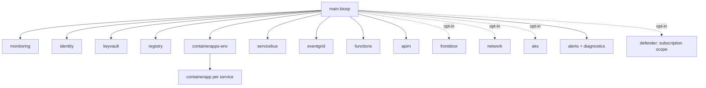

# Infrastructure (`infra/`, `azure.yaml`, workflows)

Bicep for `azd` and a Terraform twin with cost-minimized defaults and opt-in Front Door, Private Link and AKS. Validated in CI; not deployed. Azure Monitor alert rules and diagnostic settings are on by default and Defender for Cloud plans are opt-in, in both tools. The Bicep and Terraform match on the security settings that matter: an NSG on both private-networking subnets, Event Grid, Key Vault and Service Bus public access off under private networking, and an AKS profile with Azure CNI overlay plus Azure network policy, local accounts off, Entra ID with Azure RBAC, Azure Policy and Key Vault CSI rotation (`test_bicep_matches_terraform_for_nsgs_and_aks_network_policy`).

**Sections:** [1. Purpose](#1-purpose) · [2. Architecture](#2-architecture) · [3. How it works](#3-how-it-works) · [4. Key files](#4-key-files) · [5. Code excerpts](#5-code-excerpts) · [6. Configuration](#6-configuration) · [7. Commands](#7-commands) · [8. Real output](#8-real-output) · [9. Tests and eval gates](#9-tests-and-eval-gates) · [10. Guardrails](#10-guardrails) · [11. Security and governance](#11-security-and-governance) · [12. Observability](#12-observability) · [13. Failure modes](#13-failure-modes) · [14. Mapping to Azure services](#14-mapping-to-azure-services) · [15. Limitations](#15-limitations) · [16. Interview talking points](#16-interview-talking-points) · [17. Adopt this](#17-adopt-this)

## 1. Purpose

Declare every Azure service the gateways expect, keyless and reviewable, and prove it compiles without a subscription.

## 2. Architecture



## 3. How it works

1. `azure.yaml` defines one image with many commands, one per service.
2. `main.bicep` composes the modules at subscription scope with cost-minimized defaults.
3. `infra/terraform` mirrors it with plan tests.
4. `alerts.bicep` (Terraform `modules/alerts`) adds an action group, 4 metric alert rules (Service Bus dead letters, Event Grid dropped events and publish failures, Key Vault availability) and 4 KQL rules on Application Insights (failed requests, exceptions, integration failures that include HTTP 200 business rejects, authorization denials); `diagnostics.bicep` sends `allLogs` and `AllMetrics` from Key Vault, ACR, Service Bus and Event Grid to Log Analytics. `defender.bicep` (`modules/defender`) turns on Defender for Cloud plans `Arm`, `Containers` and `KeyVaults` only when `enableDefender` / `enable_defender` is true, because the plans are subscription-wide and billed.
5. CI builds Bicep with warnings as errors; the infra workflow runs Terraform checks, tflint and checkov; deploy is gated. Every action is pinned to a commit SHA, CI runs gitleaks, and CodeQL scans Python and the workflows.

## 4. Key files

| File | What it does |
|---|---|
| `infra/main.bicep` | entry point |
| `infra/modules/` | modules |
| `infra/terraform/` | Terraform twin |
| `.github/workflows/` | CI (with gitleaks), CodeQL, infra, deploy, teardown |
| `tests/test_36_reference_architecture.py` | static checks |

## 5. Code excerpts

Cost-minimized defaults and opt-in flags in `main.bicep`:

<!-- code: infra/main.bicep:15-44 -->
```bicep
param environmentName string
@minLength(1)
param location string
@description('Entra tenant used for token validation in APIM and the gateways. Empty = validation is left to the gateways (dev only).')
param entraTenantId string = ''
param apimPublisherEmail string = 'noreply@example.com'

@allowed(['Consumption', 'Developer', 'BasicV2', 'StandardV2'])
param apimSku string = 'Consumption'
@allowed(['Basic', 'Standard', 'Premium'])
param serviceBusSku string = 'Basic'
@description('Log Analytics daily ingestion cap (GB). -1 = no cap.')
param logDailyQuotaGb int = 1
param minReplicas int = 0

@description('Opt-in: Azure Front Door (Standard) in front of APIM.')
param deployFrontDoor bool = false
@description('Opt-in: VNet + private endpoints (forces Service Bus Premium, internal Container Apps environment).')
param privateNetworking bool = false
@allowed(['containerapps', 'aks'])
@description('Compute for gateways/agents/workers. The AKS profile only provisions the cluster; workloads are then applied with the same image.')
param computeProfile string = 'containerapps'

@description('Action group, metric + log alert rules and diagnostic settings to Log Analytics. Cheap; on by default.')
param enableAlerts bool = true
@description('Optional on-call email for the action group. Empty = alerts fire in Azure Monitor only.')
param alertEmail string = ''
@description('Opt-in: Microsoft Defender for Cloud plans. SUBSCRIPTION-WIDE and billed per resource, so off by default.')
param enableDefender bool = false
param defenderPlans array = ['Arm', 'Containers', 'KeyVaults']
```
<!-- /code -->

## 6. Configuration

`infra/main.parameters.json` maps azd environment values; opt-in flags enable Front Door, Private Link and AKS.

## 7. Commands

```bash
bicep build infra/main.bicep --stdout > /dev/null
pytest tests/test_36_reference_architecture.py -q
```

## 8. Real output

<!-- output: ls infra/modules -->
```text
README.md
aks.bicep
alerts.bicep
apim.bicep
containerapp.bicep
containerapps-env.bicep
defender.bicep
diagnostics.bicep
eventgrid.bicep
frontdoor.bicep
functions.bicep
identity.bicep
keyvault.bicep
monitoring.bicep
network.bicep
registry.bicep
servicebus.bicep
```
<!-- /output -->

<!-- output: python -m pytest --co -q -p no:cacheprovider tests/test_36_reference_architecture.py | grep '::' -->
```text
tests/test_36_reference_architecture.py::test_bicep_builds_without_errors_or_warnings
tests/test_36_reference_architecture.py::test_cost_minimized_defaults
tests/test_36_reference_architecture.py::test_bicep_matches_terraform_for_nsgs_and_aks_network_policy
tests/test_36_reference_architecture.py::test_event_grid_public_access_follows_private_networking
tests/test_36_reference_architecture.py::test_no_keys_or_connection_strings_for_data_plane
tests/test_36_reference_architecture.py::test_every_workload_has_its_own_identity_and_azd_service
tests/test_36_reference_architecture.py::test_workload_registrations_exist_in_code
tests/test_36_reference_architecture.py::test_workload_commands_point_at_real_modules
tests/test_36_reference_architecture.py::test_parameters_file_maps_azd_env
tests/test_36_reference_architecture.py::test_deploy_workflow_is_gated_oidc_and_promotes_with_approval
tests/test_36_reference_architecture.py::test_ci_runs_tests_lint_gate_and_bicep
tests/test_36_reference_architecture.py::test_cost_estimate_has_no_invented_prices
tests/test_36_reference_architecture.py::test_dockerfile_uses_non_root_user
tests/test_36_reference_architecture.py::test_workflows_are_hardened
tests/test_36_reference_architecture.py::test_alerts_diagnostics_and_defender_match_in_both_tools
```
<!-- /output -->

## 9. Tests and eval gates

Static architecture tests above (one skips where the Bicep CLI is missing) plus Bicep build and Terraform checks in CI. `test_alerts_diagnostics_and_defender_match_in_both_tools` fails if the alert rule names or diagnostic targets differ between Bicep and Terraform or if Defender stops being opt-in; the `dev_cost_min` and `defender_opt_in` plan tests assert the same counts and defaults.

## 10. Guardrails

- Cheapest SKUs by default.
- Deploy workflow off until a subscription exists.

## 11. Security and governance

- Managed identity and Key Vault; OIDC for pipelines.
- Actions pinned to commit SHAs with read-only default permissions; gitleaks, CodeQL and Dependabot (see `SECURITY.md`).
- Opt-in Microsoft Defender for Cloud plans (`enableDefender`), off by default because they apply to the whole subscription and are billed per resource.

## 12. Observability

Monitoring module provisions Log Analytics and Application Insights. Diagnostic settings send resource logs and metrics from Key Vault, ACR, Service Bus and Event Grid to the same workspace, and 8 alert rules route to one action group (optional on-call email). The integration-failure rule uses the same `integration.result_class` attribute as the workbook, so an HTTP 200 that hides a business error still alerts. Thresholds are untuned starting points.

## 13. Failure modes

| Failure | Result |
|---|---|
| Bicep warning | CI fails |
| Terraform invalid | infra workflow fails |

## 14. Mapping to Azure services

Container Apps, API Management, Service Bus, Event Grid, Functions, Key Vault, Container Registry, Log Analytics, Application Insights, optional Front Door, Private Link and AKS.

## 15. Limitations

- Never deployed. The alert rules, diagnostic settings and Defender plans have only been built and plan-tested offline; metric names follow the Azure Monitor reference but have not fired against real resources.
- No diagnostic settings for APIM or the Function app yet.

## 16. Interview talking points

- Same design in two IaC tools, both validated offline, with a test that fails if their alert rules drift apart.
- Alerting on business rejects hidden behind HTTP 200, not just on 5xx.

## 17. Adopt this

1. Copy `infra/`, edit parameters, run `azd up` in a sandbox subscription.
