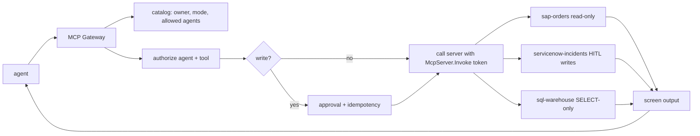

# MCP Gateway and servers (`src/aiip/mcp/`, `src/aiip/mcp_servers/`)

A fleet manager for Model Context Protocol servers: catalog, discovery, governed calls, approvals for writes and screening of server output.

**Sections:** [1. Purpose](#1-purpose) · [2. Architecture](#2-architecture) · [3. How it works](#3-how-it-works) · [4. Key files](#4-key-files) · [5. Code excerpts](#5-code-excerpts) · [6. Configuration](#6-configuration) · [7. Commands](#7-commands) · [8. Real output](#8-real-output) · [9. Tests and eval gates](#9-tests-and-eval-gates) · [10. Guardrails](#10-guardrails) · [11. Security and governance](#11-security-and-governance) · [12. Observability](#12-observability) · [13. Failure modes](#13-failure-modes) · [14. Mapping to Azure services](#14-mapping-to-azure-services) · [15. Limitations](#15-limitations) · [16. Interview talking points](#16-interview-talking-points) · [17. Adopt this](#17-adopt-this)

## 1. Purpose

MCP makes it easy to hand an agent many tools. The gateway keeps that safe: agents see only the servers their card allows, servers accept only the gateway's token, writes need a human, and anything a server returns is treated as untrusted.

## 2. Architecture



## 3. How it works

1. `catalog.py` lists each server's owner, system, mode and allowed agents.
2. `discover` and `servers` filter the catalog by the caller's card.
3. `_authorize` checks the agent and tool; write tools go through the same approval store as the Tool Gateway.
4. The gateway calls the server over streamable HTTP with a token for `api://aiip-mcp-servers` holding `McpServer.Invoke`, which only the gateway has.
5. `sql_warehouse.guard` allows one SELECT statement over allow-listed tables; PII tables are not exposed.
6. Returned text is screened by `shared/untrusted.screen`; flagged fields are withheld.

## 4. Key files

| File | What it does |
|---|---|
| `src/aiip/mcp/gateway.py` | gateway service |
| `src/aiip/mcp/catalog.py` | server catalog |
| `src/aiip/mcp_servers/sap_orders.py` | read-only SAP orders |
| `src/aiip/mcp_servers/servicenow_incidents.py` | incidents with HITL create |
| `src/aiip/mcp_servers/sql_warehouse.py` | SELECT-only SQL |
| `control-plane/mcp-catalog.json` | generated catalog |

## 5. Code excerpts

<!-- code: src/aiip/mcp_servers/sql_warehouse.py::guard -->
```python
def guard(sql: str) -> str | None:
    """Return a refusal reason, or None when the statement is acceptable."""
    s = sql.strip().rstrip(";").strip()
    if ";" in s:
        return "one statement only"
    if not re.match(r"^(select|with)\b", s, re.I):
        return "only SELECT statements are allowed"
    if FORBIDDEN.search(s) or "--" in s or "/*" in s:
        return "statement contains a forbidden keyword or comment"
    referenced = {m.lower() for m in re.findall(r"\b(?:from|join)\s+([A-Za-z_][\w.]*)", s, re.I)}
    if not referenced:
        return "no table referenced"
    if not referenced <= set(TABLES):
        return f"table not exposed: {sorted(referenced - set(TABLES))[0]}"
    return None
```
<!-- /code -->

<!-- code: src/aiip/shared/untrusted.py::screen -->
```python
def screen(value: Any, path: str = "") -> tuple[Any, list[dict[str, str]]]:
    flags: list[dict[str, str]] = []
    if isinstance(value, dict):
        out = {}
        for k, v in value.items():
            out[k], f = screen(v, f"{path}/{k}")
            flags += f
        return out, flags
    if isinstance(value, list):
        out_l = []
        for i, v in enumerate(value):
            nv, f = screen(v, f"{path}/{i}")
            out_l.append(nv)
            flags += f
        return out_l, flags
    if isinstance(value, str):
        hits = [name for name, rx in PATTERNS.items() if rx.search(value)]
        if hits:
            return WITHHELD, [{"path": path or "/", "patterns": ",".join(hits)}]
        if len(value) > MAX_STRING:
            return value[:MAX_STRING] + "...[truncated]", [{"path": path or "/", "patterns": "oversize"}]
    return value, flags
```
<!-- /code -->

## 6. Configuration

Server URLs come from `AIIP_<SERVICE>_URL` in HTTP mode; in-process mode mounts them directly. `CALL_TIMEOUT_S` in `mcp/gateway.py` bounds each call.

## 7. Commands

```bash
python -m aiip.mcp_servers sql-warehouse
pytest tests/test_29_mcp_gateway.py -q
```

## 8. Real output

<!-- output: python scripts/doc_demo.py demo 7 -->
```text
=== 7. MCP Gateway: catalog, read-only SQL, PII refusal, injection screening, HITL writes
  [ok] catalog: ['sap-orders (read-only, in-process)', 'servicenow-incidents (read-write (HITL), in-process)', 'sql-warehouse (read-only, in-process)']
  [ok] data-agent may use: ['sql-warehouse']
  [ok] data-agent SELECT on delivery_kpis: 2 rows
  [ok] SELECT on customer_pii: HTTP 400 {"code": "validation_error", "message": "table not exposed: customer_pii", "correlation_id": "<id>
  [ok] ServiceNow incident with an injected instruction: 1 field(s) withheld: {'path': '/description', 'patterns': 'override,prompt_exfil,tool_steering'}
  [ok] MCP write without a human approval: HTTP 428 approval_required
```
<!-- /output -->

## 9. Tests and eval gates

<!-- output: python -m pytest --co -q -p no:cacheprovider tests/test_29_mcp_gateway.py | grep '::' -->
```text
tests/test_29_mcp_gateway.py::test_catalog_has_three_servers_and_only_reviewed_ones_write
tests/test_29_mcp_gateway.py::test_discovery_returns_schemas_and_governance
tests/test_29_mcp_gateway.py::test_read_call_returns_structured_untrusted_data
tests/test_29_mcp_gateway.py::test_read_only_server_refuses_writes_even_with_role
tests/test_29_mcp_gateway.py::test_user_tokens_and_unlisted_agents_are_denied
tests/test_29_mcp_gateway.py::test_write_needs_idempotency_key_and_a_human_approval
tests/test_29_mcp_gateway.py::test_prompt_injection_in_server_output_is_withheld_and_flagged
tests/test_29_mcp_gateway.py::test_screen_catches_common_injection_shapes[payload0]
tests/test_29_mcp_gateway.py::test_screen_catches_common_injection_shapes[payload1]
tests/test_29_mcp_gateway.py::test_screen_catches_common_injection_shapes[payload2]
tests/test_29_mcp_gateway.py::test_screen_leaves_ordinary_business_text_alone
tests/test_29_mcp_gateway.py::test_sql_server_is_read_only_and_allow_listed[DELETE FROM delivery_kpis-only SELECT]
tests/test_29_mcp_gateway.py::test_sql_server_is_read_only_and_allow_listed[SELECT * FROM delivery_kpis; DROP TABLE delivery_kpis-one statement]
tests/test_29_mcp_gateway.py::test_sql_server_is_read_only_and_allow_listed[SELECT * FROM customer_pii-not exposed]
tests/test_29_mcp_gateway.py::test_sql_server_is_read_only_and_allow_listed[SELECT * FROM delivery_kpis -- comment-forbidden]
tests/test_29_mcp_gateway.py::test_mcp_servers_reject_callers_other_than_the_gateway
```
<!-- /output -->

## 10. Guardrails

- Read-only by default; writes need approval and an idempotency key.
- SQL is restricted to one SELECT over exposed tables.
- Injected instructions in server output are withheld, with the path and pattern recorded.

## 11. Security and governance

- Servers trust only the gateway's role; an agent token is refused.
- Every server has a named owner in the catalog.

## 12. Observability

Spans per call with server, tool and result class; demo step 10 shows MCP success by system.

## 13. Failure modes

| Failure | Result |
|---|---|
| table not exposed | 400 `validation_error` |
| write without approval | 428 `approval_required` |
| injected text | field withheld |
| server down | 503 with breaker |

## 14. Mapping to Azure services

| Piece | Azure service |
|---|---|
| servers and gateway | Azure Container Apps |
| server identity | Entra app role `McpServer.Invoke` |
| warehouse | Azure Databricks SQL (stand-in here) |

## 15. Limitations

- Three servers, all on sandbox stand-ins.
- SQL guard is regex-based; a real deployment should also use a read-only warehouse role.

## 16. Interview talking points

- Treat MCP server output as untrusted input, like web content.

## 17. Adopt this

1. Add a server under `mcp_servers/` using `_common.py` middleware.
2. Register it in `catalog.py` with owner, mode and allowed agents.
3. Regenerate `control-plane/mcp-catalog.json`.
