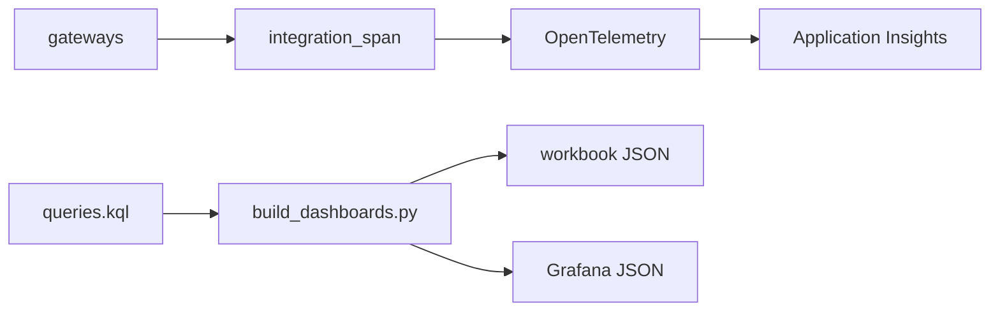

# Integration observability (`observability/`, `src/aiip/shared/telemetry.py`)

Spans with system, operation, business key and result class; completion metrics; one KQL file that generates the Azure Monitor workbook and the Grafana dashboard.

**Sections:** [1. Purpose](#1-purpose) · [2. Architecture](#2-architecture) · [3. How it works](#3-how-it-works) · [4. Key files](#4-key-files) · [5. Code excerpts](#5-code-excerpts) · [6. Configuration](#6-configuration) · [7. Commands](#7-commands) · [8. Real output](#8-real-output) · [9. Tests and eval gates](#9-tests-and-eval-gates) · [10. Guardrails](#10-guardrails) · [11. Security and governance](#11-security-and-governance) · [12. Observability](#12-observability) · [13. Failure modes](#13-failure-modes) · [14. Mapping to Azure services](#14-mapping-to-azure-services) · [15. Limitations](#15-limitations) · [16. Interview talking points](#16-interview-talking-points) · [17. Adopt this](#17-adopt-this)

## 1. Purpose

Make integration health visible in business terms: an HTTP 200 with a business error counts as failure, and process completions are tracked per outcome.

## 2. Architecture



## 3. How it works

1. `integration_span` sets standard attributes and the result class.
2. `record_process` counts completions by outcome; queue depth is an observable gauge.
3. `build_dashboards.py` renders both dashboards from `queries.kql`; CI checks they are current.

## 4. Key files

| File | What it does |
|---|---|
| `src/aiip/shared/telemetry.py` | spans and metrics |
| `observability/queries.kql` | named queries |
| `observability/azure-monitor-workbook.json` | workbook |
| `observability/grafana-dashboard.json` | Grafana |
| `scripts/build_dashboards.py` | generator |

## 5. Code excerpts

<!-- code: src/aiip/shared/telemetry.py::IntegrationSpan -->
```python
class IntegrationSpan:
    def __init__(self, span: Any) -> None:
        self.span = span
        self.result_class = E.OK

    def set_result(self, result_class: str) -> None:
        self.result_class = result_class

    def set(self, key: str, value: Any) -> None:
        if value is not None:
            self.span.set_attribute(key, value if isinstance(value, str | int | float | bool) else str(value))
```
<!-- /code -->

## 6. Configuration

`APPLICATIONINSIGHTS_CONNECTION_STRING` enables the Azure Monitor exporter.

## 7. Commands

```bash
python scripts/build_dashboards.py --check
pytest tests/test_35_observability.py -q
```

## 8. Real output

<!-- output: python scripts/doc_demo.py demo 10 -->
```text
=== 10. Integration observability (from this run) =========================
  [ok] tool-gateway success by system: {'dataverse': '2/3 ok', 'sap': '18/30 ok', 'salesforce': '8/10 ok', 'servicenow': '1/1 ok', 'workday': '2/2 ok'}
  [ok] tool-gateway identity mix: {'obo': 14, 'agent': 32}
  [ok] mcp-gateway success by system: {'mcp:sap-orders': '3/3 ok', 'mcp:sql-warehouse': '3/4 ok', 'mcp:servicenow-incidents': '2/3 ok'}
  [ok] mcp-gateway identity mix: {'agent': 10}
  [ok] a2a-gateway success by system: {'a2a:crm-agent': '4/5 ok', 'a2a:erp-agent': '3/3 ok', 'a2a:data-agent': '2/2 ok', 'a2a:care-planner': '3/4 ok', 'a2a:ap-invoice-agent': '8/8 ok'}
  [ok] a2a-gateway identity mix: {'obo': 14, 'agent': 8}
  [ok] event-gateway success by system: {'event-grid': '9/14 ok'}
  [ok] event-gateway identity mix: {'agent': 14}
  [ok] worker process completions: {'com.contoso.sap.salesorder.created.v1': {'blocked_credit_hold': 1}, 'com.contoso.sap.delivery.late.v1': {'customer_notified': 1, 'dead_lettered': 4}, 'vendor-invoice': {'completed': 1, 'timed_out_compensated': 1}}
```
<!-- /output -->

<!-- output: python scripts/build_dashboards.py --check -->
```text
dashboards up to date
```
<!-- /output -->

## 9. Tests and eval gates

<!-- output: python -m pytest --co -q -p no:cacheprovider tests/test_35_observability.py | grep '::' -->
```text
tests/test_35_observability.py::test_span_carries_integration_attributes
tests/test_35_observability.py::test_http_200_with_business_error_is_recorded_as_failure
tests/test_35_observability.py::test_result_classes_cover_timeout_and_authz_deny
tests/test_35_observability.py::test_metrics_for_calls_identity_mix_and_process_completions
tests/test_35_observability.py::test_queue_depth_gauge_reports_dead_letter_queues
tests/test_35_observability.py::test_dashboards_are_generated_from_the_kql_and_chart_the_required_views
```
<!-- /output -->

## 10. Guardrails

- Business keys, not personal data, on spans.

## 11. Security and governance

- Who-did-what query joins actor and subject.

## 12. Observability

This component is the observability layer.

## 13. Failure modes

| Signal | Meaning |
|---|---|
| success by system drops | vendor or policy issue |
| poison queue grows | event handling failing |
| identity mix shifts | unexpected agent-only calls |

## 14. Mapping to Azure services

| Piece | Azure service |
|---|---|
| traces and metrics | Application Insights |
| dashboards | Azure Monitor workbooks, Azure Managed Grafana |

## 15. Limitations

- Dashboards not imported into a live workspace.

## 16. Interview talking points

- One KQL source, two dashboards, checked in CI.

## 17. Adopt this

1. Add a named query to `queries.kql` and run `build_dashboards.py`.
