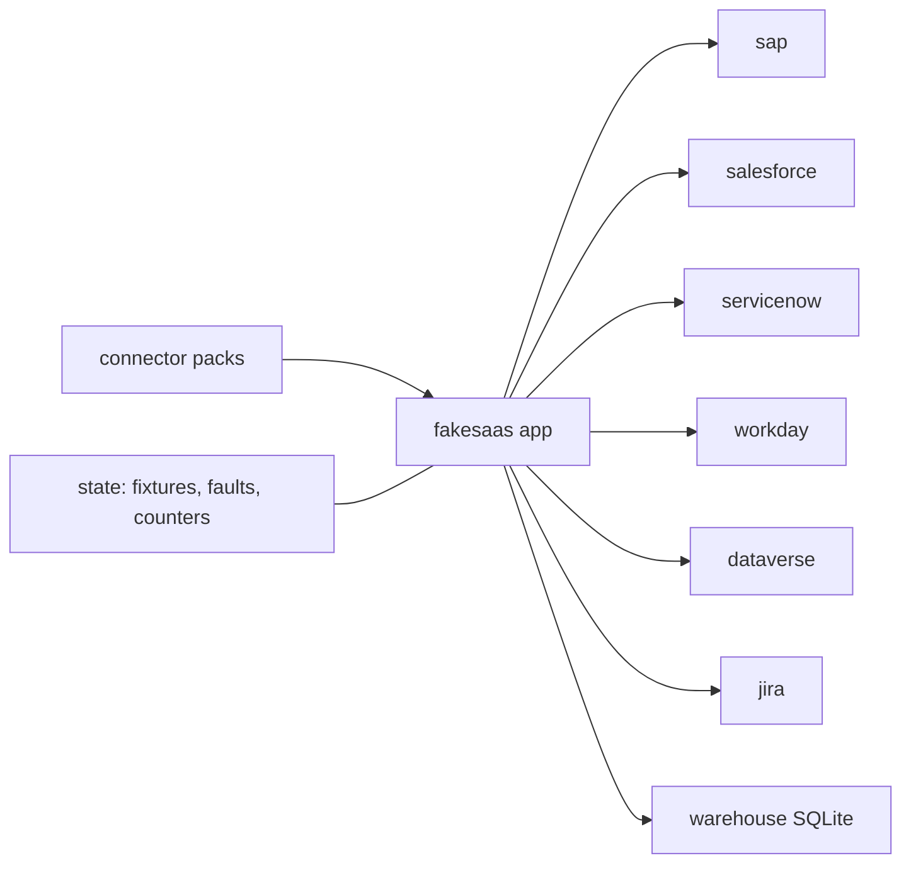

# Sandbox stand-ins (`src/aiip/fakesaas/`)

Stand-ins, not the real vendors: HTTP apps that speak each vendor's wire format closely enough for contract tests and the demo, with fault injection.

**Sections:** [1. Purpose](#1-purpose) · [2. Architecture](#2-architecture) · [3. How it works](#3-how-it-works) · [4. Key files](#4-key-files) · [5. Code excerpts](#5-code-excerpts) · [6. Configuration](#6-configuration) · [7. Commands](#7-commands) · [8. Real output](#8-real-output) · [9. Tests and eval gates](#9-tests-and-eval-gates) · [10. Guardrails](#10-guardrails) · [11. Security and governance](#11-security-and-governance) · [12. Observability](#12-observability) · [13. Failure modes](#13-failure-modes) · [14. Mapping to Azure services](#14-mapping-to-azure-services) · [15. Limitations](#15-limitations) · [16. Interview talking points](#16-interview-talking-points) · [17. Adopt this](#17-adopt-this)

## 1. Purpose

Run the whole platform offline with realistic failure behaviour (errors, latency, HTTP 200 with a business error, record-level sharing) and without any vendor account.

## 2. Architecture



## 3. How it works

1. `app.py` mounts every stand-in under one FastAPI app.
2. `state.py` holds fixtures, issued tokens, injected faults and call counters, reset per test.
3. Every response is tagged `x-aiip-sandbox-standin: true`.

## 4. Key files

| File | What it does |
|---|---|
| `src/aiip/fakesaas/app.py` | host |
| `src/aiip/fakesaas/state.py` | state and faults |
| `src/aiip/fakesaas/sap.py` | SAP OData stand-in |
| `src/aiip/fakesaas/fixtures/` | fixture data (no README: loaders glob it) |

## 5. Code excerpts

<!-- code: src/aiip/fakesaas/state.py::apply_fault -->
```python
async def apply_fault(vendor: str) -> None:
    CALLS[vendor] = CALLS.get(vendor, 0) + 1
    f = FAULTS.get(vendor)
    if not f or f.get("remaining", 0) <= 0:
        return
    f["remaining"] -= 1
    if f["mode"] == "slow":
        await asyncio.sleep(float(f.get("delay_s", 2.0)))
    elif f["mode"] == "error":
        raise HTTPException(503, detail="service unavailable (injected fault)")
    elif f["mode"] == "rate_limit":
        raise HTTPException(429, detail="rate limited (injected fault)", headers={"Retry-After": "2"})
```
<!-- /code -->

## 6. Configuration

Faults are set through `/_admin` endpoints or `state` helpers in tests.

## 7. Commands

```bash
python scripts/demo.py   # HTTP mode starts the stand-ins as their own process
```

## 8. Real output

<!-- output: python scripts/doc_demo.py demo 6 -->
```text
=== 6. Circuit breaker: SAP starts failing ================================
  [ok] HTTP 503 in <n> ms: system temporarily unavailable
  [ok] HTTP 503 in <n> ms: system temporarily unavailable
  [ok] HTTP 503 in <n> ms: system temporarily unavailable
  [ok] HTTP 503 in <n> ms: sap circuit open; failing fast
  [ok] HTTP 503 in <n> ms: sap circuit open; failing fast
  [ok] breaker state: {'salesforce': 'closed', 'dataverse': 'closed', 'sap': 'open'}
  [ok] faults cleared + breaker reset: HTTP 200
```
<!-- /output -->

## 9. Tests and eval gates

Every gateway test uses the stand-ins; `tests/test_repo_hygiene.py::test_stand_ins_are_labeled` checks the labelling.

## 10. Guardrails

- Clearly labelled as stand-ins in code, headers and docs.

## 11. Security and governance

- Fixture data is synthetic; fictional companies only.

## 12. Observability

Call counters per vendor support assertions such as "SAP holds 1 invoice".

## 13. Failure modes

Injectable: errors by status, latency, 200-with-business-error.

## 14. Mapping to Azure services

None; replaced by real vendor endpoints in a deployment.

## 15. Limitations

- Wire formats are approximations sufficient for the contract tests.

## 16. Interview talking points

- Fault injection in the stand-ins is how the failure drills are repeatable.

## 17. Adopt this

1. Add a stand-in module and mount it in `app.py`.
2. Add fixtures and fault hooks before writing the connector.
