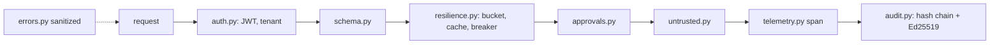

# Shared gateway pipeline (`src/aiip/shared/`)

What every gateway shares: JWT validation, secrets, telemetry, the signed audit chain, resilience, approvals, sanitized errors and untrusted-text screening.

**Sections:** [1. Purpose](#1-purpose) · [2. Architecture](#2-architecture) · [3. How it works](#3-how-it-works) · [4. Key files](#4-key-files) · [5. Code excerpts](#5-code-excerpts) · [6. Configuration](#6-configuration) · [7. Commands](#7-commands) · [8. Real output](#8-real-output) · [9. Tests and eval gates](#9-tests-and-eval-gates) · [10. Guardrails](#10-guardrails) · [11. Security and governance](#11-security-and-governance) · [12. Observability](#12-observability) · [13. Failure modes](#13-failure-modes) · [14. Mapping to Azure services](#14-mapping-to-azure-services) · [15. Limitations](#15-limitations) · [16. Interview talking points](#16-interview-talking-points) · [17. Adopt this](#17-adopt-this)

## 1. Purpose

Five gateways, one implementation of the cross-cutting controls, so behaviour is identical at every door.

## 2. Architecture



## 3. How it works

1. `auth.py` validates RS256 tokens against JWKS with audience, issuer per tenant and tenant allow-list, and builds a `Principal` with actor and subject.
2. `resilience.py` provides the per-tenant token bucket, short-TTL cache and circuit breaker with injectable clocks.
3. `approvals.py` binds approvals to tool, business key and exact arguments.
4. `audit.py` appends hash-chained records, signs each with Ed25519 and offers a read-only subscription to the monitor.
5. `errors.py` returns sanitized errors with a correlation id.

## 4. Key files

| File | What it does |
|---|---|
| `src/aiip/shared/auth.py` | JWT validation |
| `src/aiip/shared/secrets.py` | `kv://` references |
| `src/aiip/shared/telemetry.py` | OpenTelemetry |
| `src/aiip/shared/audit.py` | audit chain |
| `src/aiip/shared/resilience.py` | bucket, cache, breaker |
| `src/aiip/shared/approvals.py` | approvals |
| `src/aiip/shared/errors.py` | error model |
| `src/aiip/shared/untrusted.py` | screening |

## 5. Code excerpts

<!-- code: src/aiip/shared/resilience.py::CircuitBreaker -->
```python
@dataclass
class CircuitBreaker:
    """closed -> (N consecutive failures) -> open -> (reset timeout) -> half_open -> one probe."""

    name: str
    failure_threshold: int = 3
    reset_timeout_s: float = 30.0
    clock: Clock = time.monotonic
    state: str = "closed"
    failures: int = 0
    opened_at: float = 0.0
    transitions: list[str] = field(default_factory=list)

    def _move(self, state: str) -> None:
        if state != self.state:
            self.transitions.append(f"{self.state}->{state}")
            self.state = state

    def before_call(self) -> None:
        if self.state == "open":
            waited = self.clock() - self.opened_at
            if waited < self.reset_timeout_s:
                raise CircuitOpen(self.name, self.reset_timeout_s - waited)
            self._move("half_open")

    def record_success(self) -> None:
        self.failures = 0
        self._move("closed")

    def record_failure(self) -> None:
        self.failures += 1
        if self.state == "half_open" or self.failures >= self.failure_threshold:
            self.opened_at = self.clock()
            self._move("open")
```
<!-- /code -->

<!-- code: src/aiip/shared/approvals.py::ApprovalStore.check -->
```python
def check(self, approval_id: str | None, tool: str, args: dict, tenant_id: str) -> Approval:
    """Validate without consuming; `mark_used` after the commit succeeds so a transient failure
    can be retried under the same approval."""
    a = self.items.get(approval_id or "")
    if a is None:
        raise E.GatewayError(
            E.APPROVAL_REQUIRED, f"{tool} needs a recorded human approval (x-approval-id)"
        )
    if a.tool != tool or a.args_digest != digest(args) or a.tenant_id != tenant_id:
        raise E.GatewayError(E.AUTHZ_DENY, "approval does not match this tool call")
    if a.status != "approved":
        raise E.GatewayError(E.APPROVAL_REQUIRED, f"approval is {a.status}")
    return a
```
<!-- /code -->

## 6. Configuration

| Variable | Effect |
|---|---|
| `AIIP_ALLOWED_TENANTS` | tenants accepted |
| `AIIP_BREAKER_FAILURES`, `AIIP_BREAKER_RESET_S` | breaker |
| `AIIP_TENANT_RPS`, `AIIP_TENANT_BURST` | rate limit |
| `AIIP_KEYVAULT_NAME` | Key Vault |

## 7. Commands

```bash
pytest tests/test_27_integration_plane.py -q
```

## 8. Real output

<!-- output: python -m pytest --co -q -p no:cacheprovider tests/test_27_integration_plane.py | grep '::' -->
```text
tests/test_27_integration_plane.py::test_each_gateway_is_its_own_fastapi_service[a2a-gateway-aiip.a2a.gateway]
tests/test_27_integration_plane.py::test_each_gateway_is_its_own_fastapi_service[event-gateway-aiip.events.gateway]
tests/test_27_integration_plane.py::test_each_gateway_is_its_own_fastapi_service[identity-aiip.identity.gateway]
tests/test_27_integration_plane.py::test_each_gateway_is_its_own_fastapi_service[mcp-gateway-aiip.mcp.gateway]
tests/test_27_integration_plane.py::test_each_gateway_is_its_own_fastapi_service[tool-gateway-aiip.tools.gateway]
tests/test_27_integration_plane.py::test_agents_and_graphs_never_touch_systems_directly[__init__.py]
tests/test_27_integration_plane.py::test_agents_and_graphs_never_touch_systems_directly[__main__.py]
tests/test_27_integration_plane.py::test_agents_and_graphs_never_touch_systems_directly[apps.py]
tests/test_27_integration_plane.py::test_agents_and_graphs_never_touch_systems_directly[domain.py]
tests/test_27_integration_plane.py::test_agents_and_graphs_never_touch_systems_directly[gateways.py]
tests/test_27_integration_plane.py::test_agents_and_graphs_never_touch_systems_directly[maf.py]
tests/test_27_integration_plane.py::test_agents_and_graphs_never_touch_systems_directly[planner.py]
tests/test_27_integration_plane.py::test_agents_and_graphs_never_touch_systems_directly[graphs.py]
tests/test_27_integration_plane.py::test_agents_and_graphs_never_touch_systems_directly[activities.py]
tests/test_27_integration_plane.py::test_agents_and_graphs_never_touch_systems_directly[orchestration.py]
tests/test_27_integration_plane.py::test_gateways_share_one_token_validator
tests/test_27_integration_plane.py::test_secret_references_only
tests/test_27_integration_plane.py::test_every_hard_coded_credential_in_src_is_a_kv_reference
tests/test_27_integration_plane.py::test_spans_are_emitted_through_opentelemetry
tests/test_27_integration_plane.py::test_end_to_end_demo_runs_every_drill_in_process
```
<!-- /output -->

## 9. Tests and eval gates

The integration-plane tests above cover the shared controls end to end.

## 10. Guardrails

- Raw secrets in configuration fail fast.
- Approvals cannot be reused for different arguments.

## 11. Security and governance

- Tamper-evident audit; signature verification available to auditors.

## 12. Observability

`integration_span` standardises attributes across gateways.

## 13. Failure modes

See the error taxonomy in [connectors.md](connectors.md) and each gateway page.

## 14. Mapping to Azure services

| Piece | Azure service |
|---|---|
| tokens | Entra ID |
| secrets | Key Vault |
| telemetry | Azure Monitor OpenTelemetry |
| audit store | a write-once store such as immutable Blob storage would be needed in production (not provisioned) |

## 15. Limitations

- Audit log is local files offline; the immutable store is not provisioned.

## 16. Interview talking points

- Shared controls are why five gateways stay consistent.

## 17. Adopt this

1. Import `shared` in any new gateway and use `integration_span`, `ApprovalStore` and `AuditLog`.
