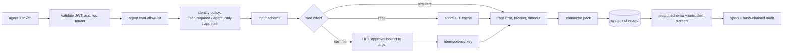

# Tool Gateway (`src/aiip/tools/`)

The single policy chokepoint between agents and systems of record. Agents send a tool name, arguments and a token; the gateway decides whether, as whom and how safely the call runs.

**Sections:** [1. Purpose](#1-purpose) · [2. Architecture](#2-architecture) · [3. How it works](#3-how-it-works) · [4. Key files](#4-key-files) · [5. Code excerpts](#5-code-excerpts) · [6. Configuration](#6-configuration) · [7. Commands](#7-commands) · [8. Real output](#8-real-output) · [9. Tests and eval gates](#9-tests-and-eval-gates) · [10. Guardrails](#10-guardrails) · [11. Security and governance](#11-security-and-governance) · [12. Observability](#12-observability) · [13. Failure modes](#13-failure-modes) · [14. Mapping to Azure services](#14-mapping-to-azure-services) · [15. Limitations](#15-limitations) · [16. Interview talking points](#16-interview-talking-points) · [17. Adopt this](#17-adopt-this)

## 1. Purpose

Agents on this platform hold no connection strings and no vendor credentials. Every function call that reaches SAP, Salesforce, Dataverse, ServiceNow, Workday or Jira goes through one service that enforces the agent card, the identity policy, schemas, human approval for money, idempotency and resilience, and writes an audit record.

## 2. Architecture



## 3. How it works

1. `invoke` validates the caller's Entra token (audience `api://aiip-tool-gateway`, issuer per tenant, tenant allow-list) and resolves the tool from `registry.py`.
2. `_authorize` checks the agent card allow-list, then the identity policy: delegated (OBO) tokens need `user_impersonation`; workload tokens need the tool's app role, and `user_required` tools refuse them.
3. Arguments are validated against the tool's JSON schema; the business key is mandatory.
4. Commit tools above their HITL threshold need an approval bound to tool, business key and exact arguments (`needs_approval`, `ApprovalStore.check`); without one the caller gets 428.
5. Commits carry an idempotency key; a retry with the same key replays the stored result (`replay_source=gateway`), and after a restart the vendor's own repeatability header replays it (`replay_source=vendor`).
6. Reads may be served from a short-TTL cache; every call passes the per-tenant token bucket, the per-system circuit breaker and the tool's timeout.
7. The connector maps the vendor response to a canonical model; an HTTP 200 carrying a business error becomes `business_reject` (422).
8. Output is schema-checked and screened for injected instructions, then a span and an audit record are written.

## 4. Key files

| File | What it does |
|---|---|
| `src/aiip/tools/gateway.py` | FastAPI service and the invocation pipeline |
| `src/aiip/tools/registry.py` | `ToolDef`s: system, side-effect class, identity policy, app role, business key, TTL, timeout, HITL threshold, schemas |
| `src/aiip/shared/approvals.py` | approvals bound to tool, key and arguments |
| `src/aiip/shared/resilience.py` | token bucket, TTL cache, circuit breaker |
| `control-plane/tool-registry.json` | generated, reviewed copy of the registry |
| `tests/test_28_tool_gateway.py` | pipeline tests and failure drills |

## 5. Code excerpts

Authorization: agent card, then identity policy:

<!-- code: src/aiip/tools/gateway.py::_authorize -->
```python
def _authorize(p: Principal, tool: ToolDef) -> None:
    if tool.name not in allowed_tools(p.actor):
        raise E.GatewayError(E.AUTHZ_DENY, f"agent card for {p.actor} does not allow {tool.name}")
    if p.is_user:
        if tool.identity == "agent_only":
            raise E.GatewayError(E.AUTHZ_DENY, f"{tool.name} runs under an agent identity only")
        if "user_impersonation" not in p.scopes:
            raise E.GatewayError(E.AUTHZ_DENY, "delegated token lacks the required scope")
    else:
        if tool.identity == "user_required":
            raise E.GatewayError(E.AUTHZ_DENY, f"{tool.name} must run as the user (on-behalf-of)")
        if tool.app_role not in p.roles:
            raise E.GatewayError(E.AUTHZ_DENY, f"app role {tool.app_role} not granted to {p.actor}")
```
<!-- /code -->

When a commit needs a human:

<!-- code: src/aiip/tools/gateway.py::needs_approval -->
```python
def needs_approval(tool: ToolDef, args: dict) -> bool:
    if tool.hitl_above is None:
        return True
    try:
        return float(args.get("amount", 0)) > tool.hitl_above
    except (TypeError, ValueError):
        return True
```
<!-- /code -->

## 6. Configuration

| Variable / field | Effect |
|---|---|
| `AIIP_TENANT_RPS`, `AIIP_TENANT_BURST` | per-tenant rate limit |
| `AIIP_BREAKER_FAILURES`, `AIIP_BREAKER_RESET_S` | circuit breaker |
| `AIIP_ALLOWED_TENANTS` | tenant allow-list for tokens |
| `ToolDef.hitl_above` | amount above which a commit needs approval (`None`: always) |
| `ToolDef.cache_ttl_s`, `timeout_s` | cache and timeout per tool |

## 7. Commands

```bash
python scripts/demo.py --inproc        # steps 3-6 exercise the gateway
python scripts/export_contracts.py --check
pytest tests/test_28_tool_gateway.py -q
```

## 8. Real output

Demo steps 3 to 6 (`python scripts/demo.py --inproc`, timings and ids masked):

<!-- output: python scripts/doc_demo.py demo 3 4 5 6 -->
```text
=== 3. Idempotent commit: retry with the same key, then again after a gateway restart
  [ok] first call: parked as 5105600001
  [ok] retry, same key: replay_source=gateway
  [ok] retry after gateway restart (idempotency cache lost): replay_source=vendor; SAP holds 1 invoice(s) for INV-9001

=== 4. business_reject: SAP answers HTTP 200 with a BAPI error in the payload
  [ok] gateway result: HTTP 422 business_reject: Tax code V9 not defined for country US

=== 5. authz_deny at the Tool Gateway: tool not on the caller's agent card
  [ok] ap-invoice-agent -> erp.park_invoice: HTTP 403 authz_deny: agent card for ap-invoice-agent does not allow erp.park_invoice
  [ok] orchestrator posts 12,000.00 without a human approval: HTTP 428 approval_required

=== 6. Circuit breaker: SAP starts failing ================================
  [ok] HTTP 503 in <n> ms: system temporarily unavailable
  [ok] HTTP 503 in <n> ms: system temporarily unavailable
  [ok] HTTP 503 in <n> ms: system temporarily unavailable
  [ok] HTTP 503 in <n> ms: sap circuit open; failing fast
  [ok] HTTP 503 in <n> ms: sap circuit open; failing fast
  [ok] breaker state: {'salesforce': 'closed', 'dataverse': 'closed', 'sap': 'open'}
  [ok] faults cleared + breaker reset: HTTP 200
```
<!-- /output -->

## 9. Tests and eval gates

<!-- output: python -m pytest --co -q -p no:cacheprovider tests/test_28_tool_gateway.py | grep '::' -->
```text
tests/test_28_tool_gateway.py::test_registry_is_valid_and_declares_policy_for_every_tool
tests/test_28_tool_gateway.py::test_catalog_is_filtered_by_the_callers_agent_card
tests/test_28_tool_gateway.py::test_allow_list_denies_tools_outside_the_card
tests/test_28_tool_gateway.py::test_identity_policy_user_required_and_agent_only
tests/test_28_tool_gateway.py::test_simulate_does_not_persist_anything
tests/test_28_tool_gateway.py::test_commit_requires_idempotency_key_and_replays_on_retry
tests/test_28_tool_gateway.py::test_idempotency_survives_gateway_restart_via_vendor_repeatability
tests/test_28_tool_gateway.py::test_input_schema_is_enforced_before_any_vendor_call
tests/test_28_tool_gateway.py::test_output_schema_violation_is_a_failure_not_passed_to_the_model
tests/test_28_tool_gateway.py::test_safe_reads_are_cached_per_subject
tests/test_28_tool_gateway.py::test_per_tenant_rate_limit
tests/test_28_tool_gateway.py::test_circuit_breaker_opens_and_fails_fast
tests/test_28_tool_gateway.py::test_business_reject_does_not_trip_the_breaker
tests/test_28_tool_gateway.py::test_timeout_is_enforced_and_classified
tests/test_28_tool_gateway.py::test_vendor_rate_limit_becomes_backoff_hint
tests/test_28_tool_gateway.py::test_errors_are_sanitized
tests/test_28_tool_gateway.py::test_audit_answers_who_did_what_to_which_business_key_when
tests/test_28_tool_gateway.py::test_requires_a_valid_token[authorization]
tests/test_28_tool_gateway.py::test_hitl_threshold_and_understated_amount_is_caught_by_sap
tests/test_28_tool_gateway.py::test_approval_is_single_use_bound_to_args_and_needs_the_right_human
```
<!-- /output -->

The contract gate (`scripts/run_eval_gate.py`) also runs every agent's golden cases through this gateway.

## 10. Guardrails

- Tools not on the caller's card are invisible (404 in the catalog) and denied (403) on invoke.
- Simulate and commit results are never cached.
- No money moves without an approval bound to the exact arguments.
- Vendor error text is sanitized before it reaches an agent.

## 11. Security and governance

- Every record carries actor (the agent) and subject (the user, under OBO).
- The audit log is hash-chained and Ed25519-signed per record.
- The registry is exported to `control-plane/tool-registry.json` and CI fails if it drifts.

## 12. Observability

`integration_span` records system, operation, business key, identity mode and result class; demo step 10 and `observability/queries.kql` turn them into success-by-system and identity-mix views.

## 13. Failure modes

| Failure | Result to the agent |
|---|---|
| tool not on card | 403 `authz_deny` |
| no approval for a commit | 428 `approval_required` |
| vendor 200 with BAPI error | 422 `business_reject` |
| vendor failing | 503 `unavailable`, then breaker open and fail fast |
| tenant rate limit | 429 `rate_limited` |
| tool timeout | 504 `timeout` |

## 14. Mapping to Azure services

| Piece | Azure service |
|---|---|
| service | Azure Container Apps behind API Management |
| tokens | Microsoft Entra ID |
| vendor secrets | Key Vault references (`kv://`) |
| spans | Application Insights |

## 15. Limitations

- Cache, rate limits, breakers and idempotency are in process memory; a multi-replica deployment needs Redis or similar.
- Vendors are sandbox stand-ins.

## 16. Interview talking points

- Agents cannot bypass policy because they have nothing to bypass it with.
- HITL enforced at the gateway, bound to the arguments, means a replayed approval cannot move different money.
- Two layers of idempotency survive a gateway restart.

## 17. Adopt this

1. Add a `ToolDef` to `registry.py` with system, side-effect class, identity policy, business key and schemas.
2. Add the tool to the calling agent's card in `a2a/specs.py`.
3. Run `python scripts/export_contracts.py` and commit the regenerated registry.
4. Add a drill to `tests/test_28_tool_gateway.py` for the new tool's failure classes.
