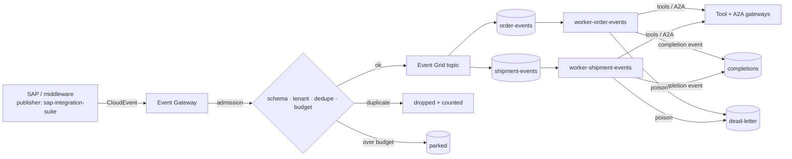

# Event-driven agents

Not every agent run starts with a chat message. Here, SAP-style business events start graphs
directly, and the worker that runs them acts as **itself** (agent-scoped identity), because there
is no user.

## Canonical events

CloudEvents 1.0, structured JSON. The business key rides as `subject` and as the `businesskey`
extension; `tenantid` and `traceparent` are extensions too.

| Class | Type | Queue | Business key | Budget / tenant / min |
|---|---|---|---|---|
| OrderCreated | `com.contoso.sap.salesorder.created.v1` | `order-events` | `order_id` | 20 |
| ShipmentLate | `com.contoso.sap.delivery.late.v1` | `shipment-events` | `delivery_id` | 5 |
| OrderTriaged | `com.contoso.aiip.order.triaged.v1` | `completions` | `order_id` | 100 |
| ShipmentHandled | `com.contoso.aiip.delivery.late.handled.v1` | `completions` | `delivery_id` | 100 |

## Admission (Event Gateway)

1. Envelope and `data` validated against the class schema.
2. `tenantid` must equal the publisher token's tenant.
3. **Dedupe** on `(tenant, type, business key)` within a window: SAP re-sends are dropped.
4. **Budget** per tenant per event class. An event storm is **parked**, not dropped and not fanned
   out into unbounded model loops. Parked events are counted in `/v1/metrics` and kept for an operator to replay (this sample has no replay endpoint).
5. Routed to the class queue (Event Grid → Service Bus in Azure; in-memory peek-lock stand-in
   locally, hosted by the Event Gateway under `/bus/*`).

## Worker settlement

| Outcome | Action |
|---|---|
| success | complete, emit completion event, record process metric |
| already processed (same tenant/type/key) | complete without re-running (idempotent consumer) |
| retryable (`unavailable`, `timeout`, `rate_limited`) | abandon; Service Bus dead-letters after `maxDeliveryCount` |
| poison (`validation`, `authz_deny`, `not_found`, `business_reject`, unknown type) | dead-letter now with a reason |

The demo shows all of it: a duplicate `OrderCreated`, a storm of 8 `ShipmentLate` events where
the budget parks 5, a credit-hold order that opens a ServiceNow incident, a late delivery that
notifies the customer, and events for unknown deliveries that land in the dead-letter queue.

## Azure code paths

`ServiceBusClientBus` (azure-servicebus, peek-lock, `DefaultAzureCredential`) and
`EventGridPublisher` (azure-eventgrid, CloudEvents) implement the same interface as the local bus.
Bicep creates the topic with CloudEvents schema, subscriptions that deliver to Service Bus queues
through the topic's managed identity, and queues with `maxDeliveryCount` and dead-lettering on
expiry. Worker Container Apps scale on queue depth with KEDA.
