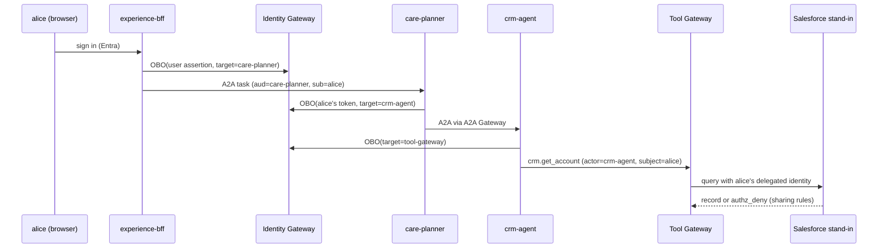

# Identity: as whom?

Every call in this platform answers one question before anything else: **which principal is this
call made as?** The answer is logged on every span and audit record as two fields:

* `actor` - the workload making the call (token `azp`: `care-planner`, `worker-order-events`, …)
* `subject` - who the call is for (the user's `oid`/`upn` for delegated tokens, or the actor itself
  for app-only tokens)

## Three models

| Model | Used by | Token | Why |
|---|---|---|---|
| **User-scoped** | interactive care journey (planner → CRM/ERP agents → Tool Gateway) | OBO: `acquire_token_on_behalf_of` for each hop | the CRM's record-level sharing must still apply; bob cannot see alice's accounts |
| **Agent-scoped** | event workers, invoice orchestrator, MCP gateway → MCP servers | client credentials / managed identity via federated credential | no user exists for an `OrderCreated` event; the worker gets named app roles only |
| **Hybrid** | planner's KPI lookup | user token for the user's records; data-agent's own identity for shared reference KPIs | reference data has no per-user ACL, and the user should not need warehouse rights |

## Rules enforced in code

* **One app registration per workload** (`aiip/identity/registrations.py`, exported to
  `control-plane/app-registrations.json`). A test fails if two workloads share one.
* **OBO only to pre-authorized targets.** The planner may exchange a user token for the CRM, ERP
  and data agents, nothing else. The CRM agent may exchange for the Tool Gateway only.
* **App roles are explicit.** `worker-order-events` holds `Orders.Read`, `Accounts.Read.All`,
  `Incidents.Write` on the Tool Gateway and `Events.Publish` on the Event Gateway. Asking for any
  other audience fails at the Identity Gateway with a named error.
* **Tool identity policy.** Each tool declares `user_required`, `agent_only` or `user_or_agent`.
  `service.upsert_incident` refuses app-only tokens; `erp.post_parked_invoice` refuses user
  tokens (the process posts money, not a person's chat session).
* **Tenant binding.** An `x-tenant-id` header that disagrees with the token tenant is an
  `authz_deny`, not a routing hint.
* **Human approvals carry the approver's own token.** The approval decision is accepted only from
  the approver the process resolved from Workday, authenticated as that user.

## Azure mode

`MsalBroker` uses MSAL `ConfidentialClientApplication` for the calling workload's own app
registration, authenticated with a **client assertion** obtained from the workload's user-assigned
managed identity (federated identity credential). No client secret exists anywhere.
`AIIP_APPID_<WORKLOAD>` supplies the real client IDs; `AIIP_MI_PRINCIPALS` maps managed identity
principal IDs to registrations so the gateway knows who is calling.

What Bicep does not do: create the Entra app registrations, app roles and federated credentials.
Those are tenant objects; `docs/deploy.md` lists the `az ad app` steps.
