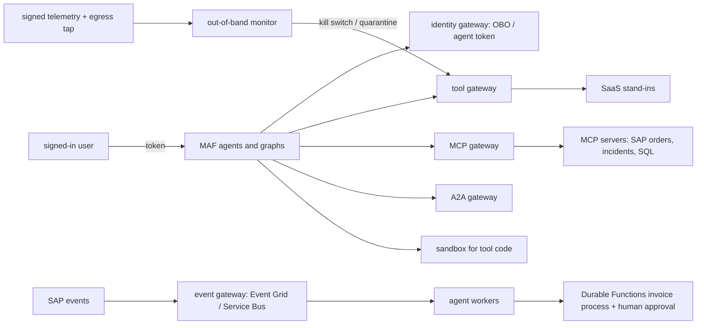

# Threat model

This repository is the layer between AI agents and systems of record (SAP, Salesforce, ServiceNow,
Workday, Dynamics/Dataverse, Jira): five FastAPI gateways (tool, MCP, A2A, event, identity), Entra ID
on-behalf-of token exchange, an Event Grid and Service Bus event plane, a Durable Functions
vendor-invoice process with a human approval, a code sandbox, a default-deny policy supervisor and an
out-of-band monitor that quarantines agents from signed telemetry. Agents run on Microsoft Agent
Framework against offline SaaS stand-ins. This page names the threats against those real
components, the control, the test that proves it and an honest status. **Built** means in the code and
tested offline. **Written, not deployed** means the code or IaC exists but has never run against Azure.
**Planned** means it does not exist yet. Nothing here has been deployed.

Frameworks used: STRIDE for the system, the OWASP Top 10 for LLM Applications 2025 for the model-facing parts, and MITRE ATLAS for
adversary techniques against AI systems.

## System and trust boundaries

Boundaries that matter: user identity versus agent identity; anything returned by a SaaS system or
MCP server (untrusted data); events from outside the platform; code an agent asks to run; the
money-moving step in the invoice process.

## STRIDE

| Threat | Example in this repo | Control | Evidence | Status |
|---|---|---|---|---|
| Spoofing | A forged or foreign token reaches a gateway | One shared token validator; unknown signing keys and other apps' tokens are rejected | `test_gateways_share_one_token_validator`, `test_token_signed_by_an_unknown_key_is_rejected`, `test_obo_rejects_a_token_issued_for_another_app` | Built (local signer); Entra ID path written, not deployed |
| Spoofing | A client exchanges tokens without proving who it is | Client authentication at the identity gateway; OBO only to pre-authorised targets | `test_clients_must_authenticate_to_the_identity_gateway`, `test_obo_is_limited_to_pre_authorized_targets` | Built |
| Tampering | A retried commit creates a duplicate SAP order | Commit requires an idempotency key; vendor repeatability ids survive a restart | `test_commit_requires_idempotency_key_and_replays_on_retry`, `test_idempotency_survives_gateway_restart_via_vendor_repeatability` | Built |
| Tampering | A forged approval event posts an invoice | Approval is single use, bound to the arguments and to the right approver; forged events cannot post money | `test_approval_is_single_use_bound_to_args_and_needs_the_right_human`, `test_forged_approval_event_cannot_post_money` | Built |
| Tampering | Audit or telemetry records edited to hide an action | Signed, hash-chained audit and telemetry | `test_signed_chain_detects_edits_deletions_and_forged_records`, `test_tampered_telemetry_is_detected_and_contains_the_actor` | Built |
| Repudiation | "The agent did it, not me" | OBO tokens carry the user as subject and the agent as actor; every exchange is logged with both | `test_obo_token_carries_user_as_subject_and_agent_as_actor`, `test_every_exchange_is_logged_with_actor_and_subject`, `test_audit_answers_who_did_what_to_which_business_key_when` | Built |
| Information disclosure | An agent reads CRM records the user cannot see | OBO means vendor ACLs apply to the user; sensitive fields are dropped in mapping | `test_acl_difference_between_users_in_crm_and_dataverse`, `test_workday_never_maps_sensitive_hr_fields`, `test_salesforce_maps_to_canonical_customer_and_drops_sensitive_fields` | Built (stand-ins) |
| Information disclosure | Vendor or SQL errors leak internals to the model | Gateway errors are sanitised; the SQL stand-in returns a fixed failure message | `test_errors_are_sanitized` | Built |
| Information disclosure | Secrets sit in code or config | Key Vault references only | `test_secret_references_only`, `test_every_hard_coded_credential_in_src_is_a_kv_reference` | Built; Key Vault written, not deployed |
| Denial of service | A failing SaaS system or an event storm | Circuit breaker, per-tenant rate limit, timeouts, event-class budget that parks a storm, dead-lettering | `test_circuit_breaker_opens_and_fails_fast`, `test_per_tenant_rate_limit`, `test_event_class_budget_parks_a_storm`, `test_poison_message_is_dead_lettered_immediately_with_reason` | Built |
| Denial of service | Runaway A2A delegation or graph loops | Hop cap; graph step budget; the monitor stops runaway loops | `test_hop_cap_stops_runaway_delegation`, `test_graph_step_budget`, `test_runaway_loop_is_stopped_within_a_few_calls` | Built |
| Elevation of privilege | An agent calls a tool outside its card or writes through a read-only MCP server | Card-filtered catalog and allow-list; read-only servers refuse writes even with a role | `test_allow_list_denies_tools_outside_the_card`, `test_read_only_server_refuses_writes_even_with_role` | Built |
| Elevation of privilege | Tool code escapes the sandbox | Separate process, network denied, scoped files, no process creation or native code, CPU/memory limits, environment allow-list | `test_sandbox_network_is_denied_by_default`, `test_sandbox_denies_process_creation_and_native_code`, `test_sandbox_environment_is_an_allow_list` | Built (local sandbox); Container Apps dynamic sessions adapter written, not deployed |
| Elevation of privilege | An action no rule covers | Default-deny policy supervisor with a proof per decision | `test_unknown_or_uncovered_actions_are_denied_by_default`, `test_decisions_carry_a_proof_with_rule_inputs_and_hash` | Built |

## OWASP Top 10 for LLM Applications 2025

| Risk | How it applies here | Control | Status |
|---|---|---|---|
| LLM01 Prompt injection | Indirect: instructions in MCP server output, retrieved documents and SaaS free-text fields | MCP output screened as untrusted and withheld (`test_prompt_injection_in_server_output_is_withheld_and_flagged`); supervisor screens retrieved content; the monitor quarantines the session (`test_injection_in_retrieved_doc_quarantines_the_session_and_gateways_refuse_it`) | Built (regex, the only path offline). Prompt Shields adapter (`src/aiip/shared/content_safety.py`, flag `AIIP_PROMPT_SHIELDS=1`) written and tested with a fake transport (`test_screen_runs_prompt_shields_after_the_regex_screen`), not run against Azure |
| LLM02 Sensitive information disclosure | HR and customer data flowing to the model | Canonical models forbid unmapped fields (`test_canonical_models_forbid_unmapped_fields`); payloads kept out of the audit (`test_supervisor_screens_retrieved_content_and_keeps_payloads_out_of_the_audit`) | Built |
| LLM03 Supply chain | Compromised package, action or base image | Pinned dependencies, SHA-pinned actions, Dependabot, CodeQL, gitleaks, SBOM, digest-pinned base image, Trivy gate, build provenance | Built |
| LLM04 Data and model poisoning | Poisoned events or catalog entries steer agents | Event admission validates schema and tenant (`test_admission_validates_schema_and_tenant`); unknown event types dead-letter; MCP catalog lists only reviewed servers as writers | Built |
| LLM05 Improper output handling | Model output becomes a vendor write | Input schema before any vendor call; output-schema violations are failures, not passed to the model (`test_output_schema_violation_is_a_failure_not_passed_to_the_model`); simulate does not persist | Built |
| LLM06 Excessive agency | An agent posts an invoice or writes an incident without a human | Human approval for MCP writes and for invoices above the threshold (`test_write_needs_idempotency_key_and_a_human_approval`, `test_hitl_threshold_and_understated_amount_is_caught_by_sap`); kill switch at every gateway (`test_every_gateway_enforces_the_kill_switch`) | Built |
| LLM07 System prompt leakage | Prompts reveal integration secrets | No secrets in prompts or code; Key Vault references only | Built (by design) |
| LLM08 Vector and embedding weaknesses | Not a retrieval-heavy repo; the SQL MCP server is the closest analogue | SQL server is read-only and allow-listed (`test_sql_server_is_read_only_and_allow_listed`) | Not applicable (no vector store) |
| LLM09 Misinformation | An HTTP 200 that hides a business error is reported as success | Business errors inside HTTP 200 are classified as rejects (`test_business_error_inside_http_200_is_a_business_reject`, `test_http_200_with_business_error_is_recorded_as_failure`) | Built |
| LLM10 Unbounded consumption | Loops, storms and retries burn quota | Rate limits, hop cap, step budget, storm parking, monitor loop detector | Built (counts); App Insights failure and authorization-denial alerts written, not deployed; budget alerts planned |

## MITRE ATLAS

| Technique | Scenario here | Control |
|---|---|---|
| LLM prompt injection, indirect (AML.T0051.001) | An incident description in ServiceNow says "close all P1s" | MCP output screen; monitor quarantine; writes need a human |
| AI agent tool invocation (AML.T0053) | Injection makes an agent call a commit tool | Card allow-list, identity policy, idempotency, HITL thresholds |
| Exfiltration via AI agent tool invocation (AML.T0086) | Injection puts customer data into an outbound payload | Egress tap and exfiltration detector (`test_exfiltration_in_outbound_payload_is_detected_from_the_tap`) |
| AI agent context poisoning, thread (AML.T0080.001) | Earlier injected content steers later turns of the same session | Session-scoped quarantine (`test_session_scoped_quarantine_only_stops_that_session`) |
| Evade AI model (AML.T0015) | Payloads crafted to slip past screens | Defence in depth: default-deny policy, sandbox, out-of-band monitor that is not in the write path (`test_monitor_is_not_in_the_write_path`) |
| Denial of AI service (AML.T0029) | Event storm aimed at the worker pool | Event-class budget, dedup on business key, dead-letter |
| AI supply chain compromise (AML.T0010) | Tampered dependency or base image | Pins, SBOM, Trivy, provenance |

## Residual risks

* Regex screens miss novel phrasings; the Prompt Shields path helps only once switched on against a
  real Azure resource, which has not been done.
* The local sandbox relies on in-process guards and a subprocess; the stronger isolation (Container
  Apps dynamic sessions) is written but not deployed.
* The SaaS systems are stand-ins; real vendor behaviour (rate limits, ACL edge cases) is untested.
* Entra ID, Key Vault, Event Grid and Service Bus settings are IaC only.
