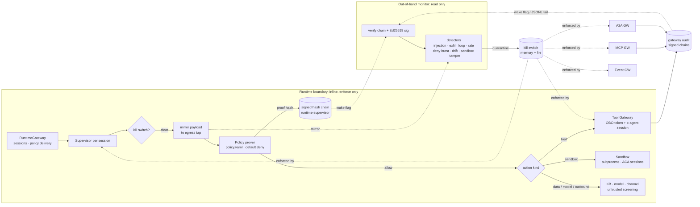

# safety: runtime safety layer

A software-only runtime boundary and watchdog for the agents on this platform. It is modelled
on the ideas behind NVIDIA's Open Agent Safety Platform (announced 28 Sep 2026): a secure runtime
around the agent harness, plus an independent monitor that can contain an agent quickly. It is
**not** NVIDIA code, uses none of their APIs and does not reproduce their hardware enforcement.
It reuses what the platform already has: the gateways, Entra token validation with OBO, the
`kv://` secret resolver, untrusted-content screening and the hash-chained audit log (now signed).

Two halves, kept apart on purpose:

* **Inline (in the agent's path): enforce only.** The supervisor checks the kill switch, proves
  the action against policy, writes the decision and runs the action (tool calls in the Tool
  Gateway, code in the sandbox). It never looks for threats in telemetry.
* **Out-of-band (off the path): detect and contain.** The monitor reads the signed audit streams
  and an egress tap on its own thread or in its own process, runs the detectors and flips the
  kill switch. Writers only set a wake-up flag for it; a stalled monitor does not slow agents
  (`test_monitor_is_not_in_the_write_path`).

## Where each NVIDIA platform component lives here

| NVIDIA component (their name) | Idea in one line (our wording) | This repo | How faithful |
|---|---|---|---|
| OpenShell **gateway** | control point that creates sessions and hands them policy | [`supervisor.py`](supervisor.py) `RuntimeGateway` | Software analog. Sessions are opened from a validated Entra token (OBO or agent), get the current policy digest, a sandbox executor and a data scope. |
| OpenShell **supervisor** | per-workload process that checks each outbound request against policy | [`supervisor.py`](supervisor.py) `Session`; kill-switch checks in the Tool / MCP / A2A / Event gateways | Software analog. Covers tool, sandbox, data, model and outbound actions that go through it; the existing gateways re-check identity, roles, schemas and HITL. |
| OpenShell **policy prover** | policy evaluated (and explainable) before anything runs | [`policy.py`](policy.py), [`policy.yaml`](policy.yaml) | Rule evaluator with default deny and a per-decision proof (rule id, inputs checked, proof hash in the signed chain). It is not a formal verifier: it does not prove properties of the policy set itself. |
| OpenShell **sandbox** | kernel-level limits on files, processes and network for the agent's work | [`sandbox.py`](sandbox.py), [`sandbox_runner.py`](sandbox_runner.py) | Subprocess with rlimits, clean env, scoped paths, audit hooks, and a network namespace where the host allows it. Container / Hyper-V isolation via the ACA dynamic sessions adapter (stub). No Landlock / seccomp. |
| Sentry **continuous monitoring** | watchdog outside the agent's stack, always reading | [`monitor.py`](monitor.py) `OutOfBandMonitor` (thread, or `python -m aiip.safety.monitor` as its own process) | Separate thread or OS process. Not separate hardware. |
| Sentry **trusted telemetry** | evidence the agent cannot quietly rewrite | [`../shared/audit.py`](../shared/audit.py) (every audit log: hash chain + Ed25519 signature), [`tap.py`](tap.py) | Tamper-evident against anyone without the signing key. The key sits with the writing service, so a fully compromised gateway host could still sign lies; see the hardware note. |
| Sentry **detection pipeline** | detectors over the telemetry stream | [`monitor.py`](monitor.py) detectors, [`patterns.py`](patterns.py) | Deterministic detectors (patterns, counters, baselines). No ML. |
| Sentry **containment / quarantine** | stop a misbehaving agent within milliseconds | [`killswitch.py`](killswitch.py), enforced in `tools/`, `mcp/`, `a2a/`, `events/` gateways and the supervisor | Session- or actor-scoped quarantine. Measured latency below; enforcement is a software check at each gateway. |

## Hardware enforcement is out of scope

Sentry's in-silicon enforcement runs on a BlueField DPU, independent of the host CPU and OS. That
cannot be reproduced in software on the same machine: here the monitor, the kill switch and the
gateways share a host (and in-process tests share a Python interpreter), so a compromise of that
host defeats them. In production this layer would move down to platform and hardware controls:
Container Apps dynamic sessions or AKS with Kata / confidential containers for the sandbox, NSG /
Azure Firewall egress deny for networking, the monitor on separate infrastructure fed by Event
Hubs, signing keys in Key Vault Managed HSM, and DPU / SmartNIC enforcement where the hardware
exists. Everything here is offline and nothing is deployed.

## Measured on this machine

`python scripts/run_safety_evals.py` (see [`../../evals/safety-scores.json`](../../../evals/safety-scores.json) for the last run):
all 9 attack scenarios contained, 0 of 4 benign scenarios quarantined, containment latency (kill switch set
minus triggering record's timestamp) about 0.5-2 ms in-process. The cross-process test (monitor
tailing JSONL, file-backed kill switch) measured about 1 ms. Tests assert < 50 ms in-process and
< 250 ms cross-process so shared CI runners have headroom. These numbers cover detection and
containment only. An attacker gets whatever the agent can do before the monitor acts; in the loop
scenario that was 8 identical reads.

## Limits worth knowing

* Python audit hooks are a tripwire, not a security boundary; determined native code could get
  around them. That is why the sandbox also uses rlimits, a separate process, a clean env and
  (where available) a network namespace, and why production should use a container / session.
* Payload inspection is pattern-based ([`patterns.py`](patterns.py)): it catches SSNs, card numbers,
  JWTs, private keys, secret assignments and connection strings, not paraphrased or encoded data.
* A prompt-injection detection quarantines the whole session even though screening already
  withheld the text. That is a deliberately strict choice.

| File | What it does |
|---|---|
| [`supervisor.py`](supervisor.py) | `RuntimeGateway` (sessions from validated tokens) and `Session` (kill switch, tap, prove, record, execute, screen) |
| [`policy.py`](policy.py) | Policy prover: YAML rules, deny-then-allow, default deny, proofs with inputs and hash |
| [`policy.yaml`](policy.yaml) | The runtime policy and the per-agent model baselines for drift detection |
| [`sandbox.py`](sandbox.py) | `SubprocessSandbox` (tested), `ContainerAppsSessions` adapter (stub), sandbox tool registry |
| [`sandbox_runner.py`](sandbox_runner.py) | Child-side bootstrap: rlimits, audit hook for network / files / processes / native code |
| [`monitor.py`](monitor.py) | Out-of-band monitor: verified ingest, detectors, quarantine, latency; CLI for a separate process |
| [`killswitch.py`](killswitch.py) | Session / actor quarantine store (memory + shared JSONL file) enforced by the gateways |
| [`tap.py`](tap.py) | Egress tap: bounded mirror of outbound payloads, readable only by the monitor |
| [`patterns.py`](patterns.py) | Sensitive-data classes and injection markers (reuses `shared/untrusted.py`) |
| [`stand_ins.py`](stand_ins.py) | Offline stand-ins for a knowledge base, a model endpoint and a message channel |
| [`evals.py`](evals.py) | Attack / benign scenario runner and gate used by `scripts/run_safety_evals.py` and tests |
| [`__init__.py`](__init__.py) | Package marker |
